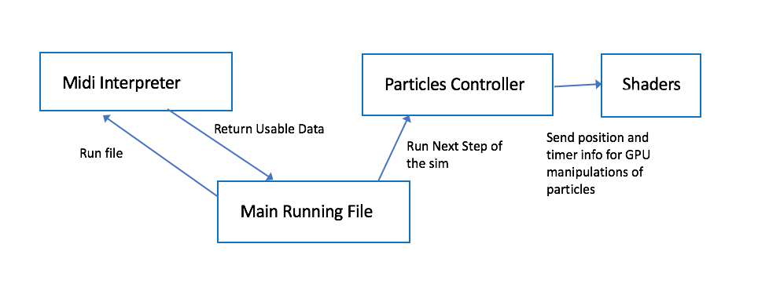

Hannah Bollar. PennKey: hbollar.
======================

**University of Pennsylvania, CIS 700: Procedural Graphics, Final Project**

# Final Report

Turn volume on and possibly wear headphones to hear the sound.

###### [Click Here to View the Current Project](https://hanbollar.github.io/Final-Project/)

### About the Look of the Project

This project interprets the wave file data of four particular songs and emits particles from six balls that each correspond to a particular set of binned bits of the wave file data. If the value of the bits for a bin are above a particular threshold then that bin's ball will emit a particle. The coloring of the particle then depends on how much the actual value is greater than the tested threshold value. The colors begin at white then as the difference between the two values becomes larger the colors shift to yellow, orange, red, and finally pink. As the particles are emitted, there is a bit of noise affecting their movement as they shift through space that increases the further the particles are from the center ball. A particle dies and is removed once it is too far from the center ball. As explained in the 'The Audio' section, this visualizer works well for vibrant songs that have varying output in terms of strong tones but are constantly changing distribution in regards to which tones have more importance during particular moments of the song.

### The Audio

- #### Legend of Zelda - Wind Waker's Main Theme [Source Video](https://www.youtube.com/watch?v=gEoU70DXr90)
  ###### Demonstration of a vibrant song. Its output varies between even tones [mostly whites] and strong tones [pinks and reds] while also allowing for a consistently changing number of balls from which particles are being emitted. The most interesting version of song to be used for this visualizer.

- #### The Turkish March an orchestra version (Rondo Alla Turca) [Source Video](https://www.youtube.com/watch?v=se_Swf7-68M)
  ###### Demonstration of a pretty even song on the music visualizer that doesnt become too powerful. Particles come out pretty consistently from each ball output for this song; however, throughout the entirety of the piece, the particles remain mostly in the white, yellow, and orange range.

- #### Maple Story Music - Ellinia [Source Video](https://www.youtube.com/watch?v=_M-ytoRguS8)
  ###### Demonstration of a build up song using this music visualizer. Very few particles come out at the beginning and almost all are white, and by the end the song is in full force showing most colors for the particles and outputing from all balls on the ring.

- #### Pirates of the Caribbean [Source Video](https://www.youtube.com/watch?v=27mB8verLK8)
  ###### Demonstration of a strong and powerful song using this music visualizer. Shows strong color variation from the particles and particles almost consistently come out of each ball.

## Updated Design Doc

- #### Introduction
  ###### What motivates this project?

  * I've worked with learning a lot of different procedural techniques throughout this past semester now I want to see if I can combine parts of them with my interest in particle simulations.

- #### Goal
  ###### What do you intend to achieve with this project?

  * Creating a functioning music visualizer that not only has manipulations based on coloring/shader information but also noise and time manipulations to create the piece altogether. Main idea - take what i learned this semester and using artistic choices decide how to incorporate them all together to build a final cohesive project.

- #### Inspiration/reference: 
  ###### Attach some materials, visual or otherwise you intend as reference

  * Inspirational youtube videos
  https://www.youtube.com/watch?v=fpViZkhpPHk&list=PL_2OwBBRw9hDSXyaIPrCeKUCNnCrHAHEn
  https://www.youtube.com/watch?v=KiRLdhnDKwc&list=PL_2OwBBRw9hDSXyaIPrCeKUCNnCrHAHEn&index=14
  https://www.youtube.com/watch?v=82Q6DRqf9H4&list=PL_2OwBBRw9hDKSZvusG6aBFh6bx32E9i5
  * Working with Wave file data 
  https://blogs.msdn.microsoft.com/dawate/2009/06/23/intro-to-audio-programming-part-2-demystifying-the-wav-format/

- #### Specification:
  ###### Outline the main features of your project

// still to do !!!
- #### Techniques:
- ###### (1) Not really using algorithms - instead using a binning technique for particular bits as explained in the above 'About the Look of the Project' section.
- ###### (2) RGB interpolation based on eye location in reference to viewer for coloring
- ###### (3) Working on shader manipulations for texture and coloring
  -  the plane uses a blue based opacity
  -  the balls are rendered with an opacity and a coloring such that the green and purple remain in the same locations relative to the eye position for the object to give the ringed effect
- ###### (4) Update and timers
  - timing the update functions to properly maintain the movement of the particles and the reloading of particular pieces when each song plays
- ###### (5) Noise function that affects the music particles position in space with increasing amplitude the farther the particles get from their source
  - Note that the noise function is entirely position based so all points that come from each ball will follow the same noise based path [looked better this way -with the lines- than not having the lines since it more easily shows a pause in the level of power of in the music]
- ###### (6) using THREE.js sound manipulation tools
  - interpretation of wave file data
  - allow for the playing of multiple pieces of music

- #### Design:
  ###### How will your program fit together? Make a simple free-body diagram illustrating the pieces.
  

- #### Timeline:
- ### Milestone 1
  * positioning of spots where balls shoot out
  * gui to pick which music to play [for now just have it as a pause and play button for playing one set of music]
  * have all the shader materials set up for everything but the balls [balls will have gpu manipulations based on time so for now leave as default]
  * add box to pause and play
  * add box to maintain repeat for song or not
  * make so the loaded song plays out the speakers with the right timing [ie using same timer as gl]

- ### Milestone 2
  * set up using of music data for particles being shot out from particular location - by indexing from 0 - 7 [later to be implemented that the frequency will convert to fill the 0-7 indexing bins once i have the proper way to interpret the wave file data]
  * add noise to the movement of the balls
  * particles disappear when theyre farther than a specific distance from the center of the region
  * set up Particles manipulation class and proper connections between framework and data held within the class so can easily create / add / manipulate all at once
  * rebuilt skybox with proper coloring

- ### Milestone 3 [ready for submission]
  * display time in secs and in proper minutes per the amount remaining in the song
  * readjust bin allocation for which bits being used from the wave file data
  * set up restart button for the music
  * add color val based on being specific amounts above the particle show up threshold
  * add actual music interpretation of the wave data
  * allow for loading of different music [used large variation in song type to demonstrate how my visualizer performs for each kind]
  * noise affecting the points more by distance
  * change the music selection so done in a drop down menu and not a slider
  * set up gui element for which song is currently playing
  * when loading a new song - if currently paused on prev song, this song starts as paused

## Results
     </t>Pirates of the Caribbean: very colorful uses most balls throughout the duration of the song.
     </t>Also demonstrates how the gui looks
    ![PCaribbean][imgP]
     </t>Wind Waker: less colorful at the beginning and shows the cuts demonstrating particular balls bins not getting above their set outputs
    ![WWaker][imgW]

## Evaluation
    How well did you do? What parameters did you tune along the way? Include some WIP shots that compare intermediate results to your final. Explain why you made the decisions you did.

## Future Work
    Given more time, what would you add/improve

## Acknowledgements
    Music:

    Cite EVERYTHING . Implemented a paper? Used some royalty-free music? Talked to classmates / a professor in a way that influenced your project? Attribute everything!

[imgP]: ./images/pCandGui.png "ImageP"
[imgW]: ./images/pCandGui.png "ImageW"