# Procedural Terrain using Cesium - Final Report

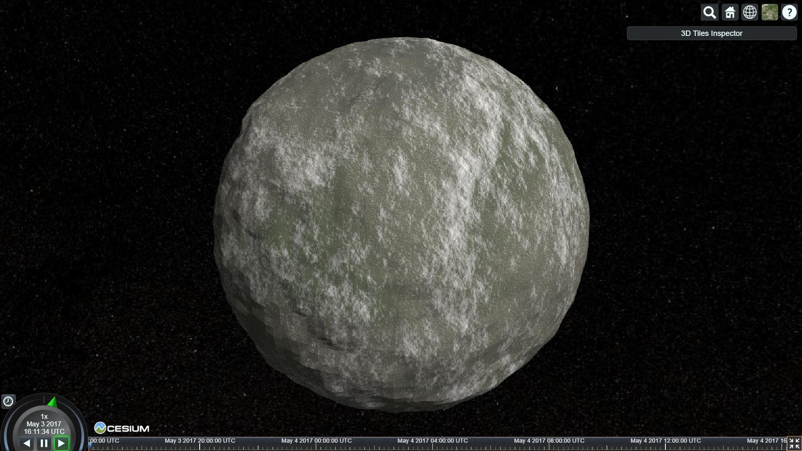

### Table of Contents

1. Design Document
2. Results
3. Evaluation
4. Future Work
5. Acknowledgements

**The code in this repository is a copy of the code in [this](https://github.com/rms13/Procedural-3D-Tiles-Server) repository, which is a fork of Cesium.**

**The project is not deployed as it creates a server to serve tilesets to cesium. gh-pages do not support server creation**

------------------------------------

## Design Document

### Introduction
This project consists of procedural generation of terrain and textures for Cesium. Cesium fetches tiles with geometry data from a server. We will be adding proceduralism to Cesium by providing the procedural terrain in place of pre-modelled structures.

### Goal
The geometry data Cesium fetches from the servers is based on the camera position. When the camera moves to an object, a higher resolution mesh is rendered. Our goal is to develop an algorithm that can generate terrain and textures in such incremental levels of detail. We will be creating a web server to provide the generated content.

### Inspiration/ Reference
Some cool demos that inspired us to do this project:
- Ixaleno: A 4kb executable by IQ: tps://www.youtube.com/watch?v=XAWPCmVC5jA
- fp.skiView: IQ again: https://www.shadertoy.com/view/XdjXDK
- Planet Shadertoy: by reinder: https://www.shadertoy.com/view/4tjGRh

### Specification
Our final product would feature:
- Procedurally generated terrain.
- Procedurally generated texture for the terrain.
- Varying levels of detail for the terrain and the textures based on the distance of the camera from the terrain.
- Web server serving the content to Cesium.

### Techniques

#### Terrain Generation
1. For the procedural terrain generation part we are planning to make a 3D height field using pseudorandom perlin noise that will be divided into a set of tiles to discretise the terrain creation.

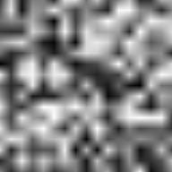
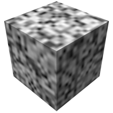
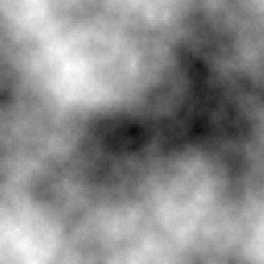

2. Another method for obtaining the initial seed values for the terrain can be generated using various fractal patterns as mentioned below.

3. Using the seed random data converted to a 2D array, we will apply the Diamond-Square algorithm to procedurally generate and tessellate the terrain with realistic looking mountain, valleys and rough terrain.

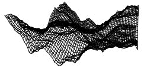
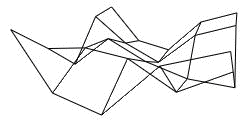

4. Another approach that can be used to generate the terrain would be as mentioned in this article [[1]](http://www-cs-students.stanford.edu/~amitp/game-programming/polygon-map-generation/) using voronoi patterns. We don’t exactly know how cesium tiling works and how we can use this methods to procedurally generate more definition in the terrain as the level of detail increases. We will get a better idea on which methods are feasible to use once we get an understanding on how cesium works.

#### Texture Generation
We will be working on multiple texture generation algorithms to achieve different terrain effects.

1. Fractals: This can be used if the finer details are to be added to coarser images, as fractals are repetitive. Also, we can get other cool terrain features like rivers using fractals.

2. Voronoi patterns / Cell noise / Worley noise: To achieve a dry land kind of effect, one of these methods will be used. These can also be used for texturing stones.

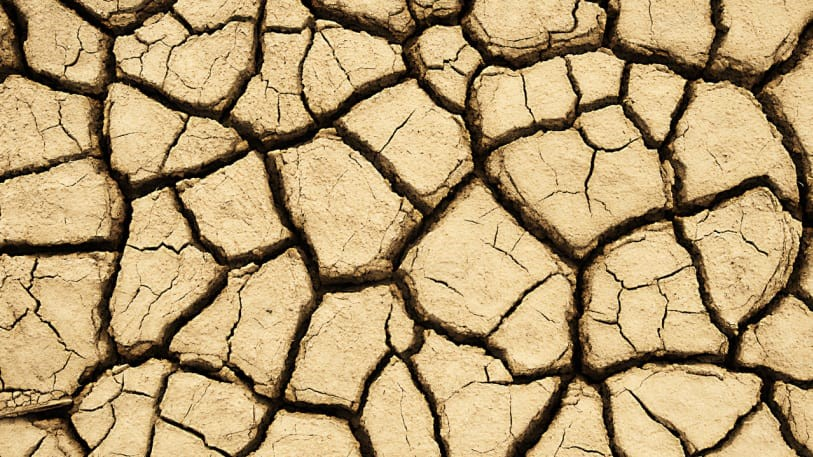

3. Ridged fractal/perlin noise: This will be used for creating smoother looking textures like desert or snow, and for blending the textures. This is very similar to the original Perlin noise algorithm, with some modifications [[2]](http://www.inear.se/2010/04/ridged-perlin-noise). We will be using either one of those. Examples of ridged fractal noise textures:

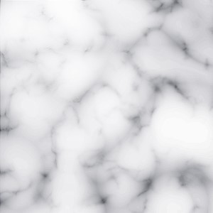
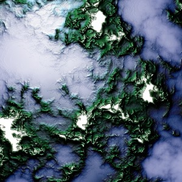
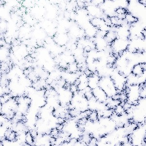

4. Blending different textures for smoother transition. Dirt and snow on mountains, sand and water on beaches, etc. don’t have hard edges. We don’t have a proper idea of what the best method would be to achieve this. There are some articles describing the use of height maps to do this [[3]](http://www.cprogramming.com/discussionarticles/texture_generation.html). We will get a better idea about this as we begin working on the generation algorithms.

### Design
As stated before, Cesium obtains tiles from the server. We will be creating a web server that provides the 3D tile content.

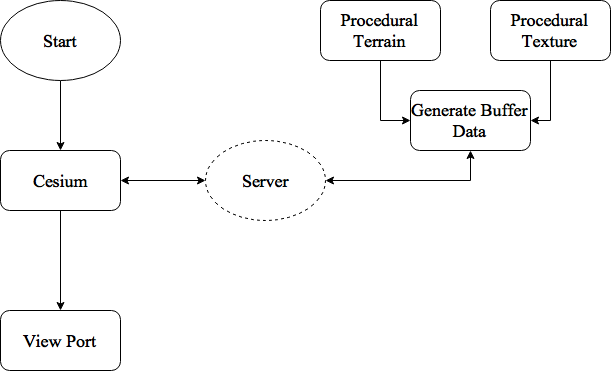

------------------------------------

## Results

Terrain (gif):

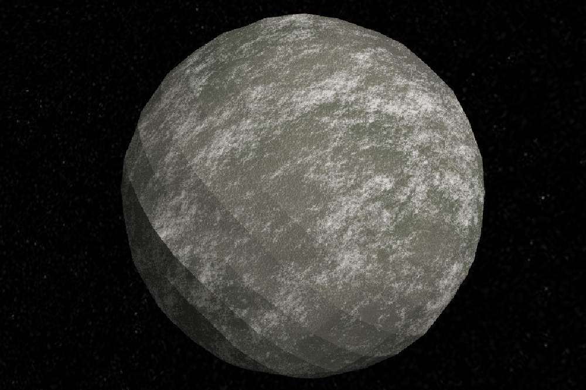

Texture (png and gif):

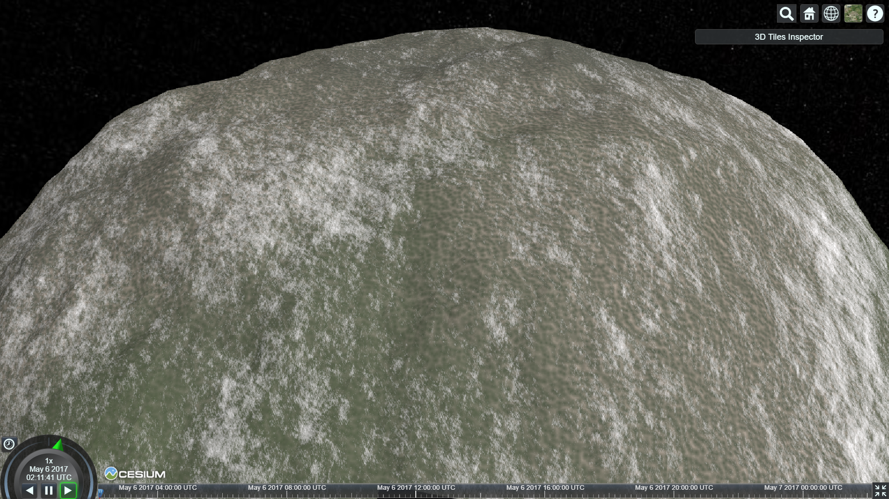

------------------------------------

## Evaluation

### Terrain

#### How A Tile Is Rendered Using Cesium

- `Tile Request:`First the Cesium server is requested with a tile to be drawn. A tile is represented by any one of the quads in the image as shown below.

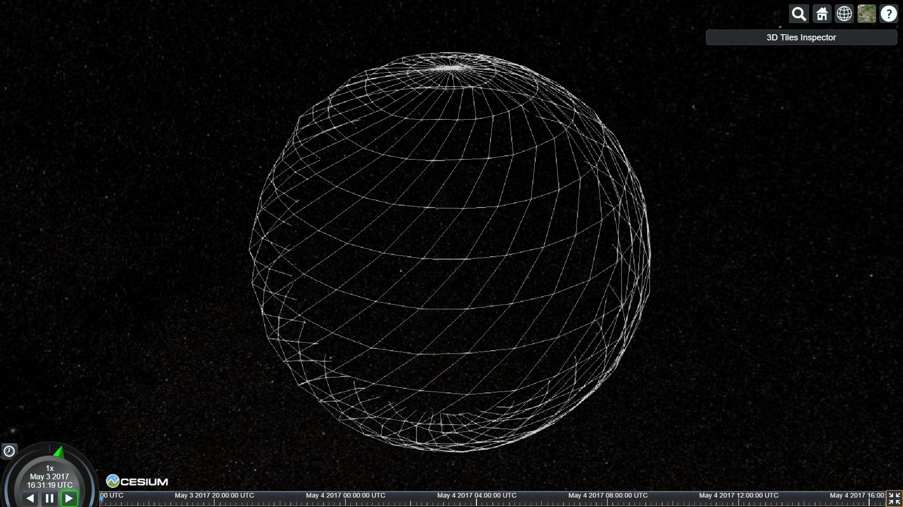

- `Bounding Box:`For the requested tile, four corners are created based on the position of the points along the latitude and longitude on the sphere.

- The four corners are run through the 3D multi octave noise to generate the noise value for them which will be used as a metric to estimate the max and min height of the encompassing bounding box.

- While generating the bounding box the distance of the camera is also taken into account as the octaves to which the noise is sampled is dependent on it. The farther the distance the less number of octaves to sample and the closer the distance the more the octaves. This

configuration helps in determining a tighter fit bounding box.

- The distance metric is not sufficient to generate a tight bounding box, we also need to estimate and __add__ the __error__. There could be points inside the tile for which the height value may exceed the maximum or minimum bounds so in order to estimate the error we go three depths deep i.e we calculate the error for k+3 octaves, where k = octaves.

 __Error = pow(persistence,k+1) + pow(persistence,k+2) + pow(persistence,k+3)__

 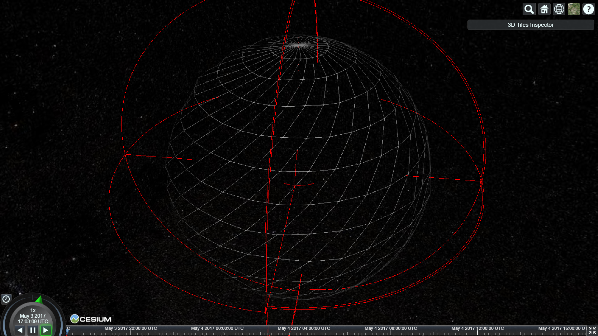

-`Subdivide Tile:`once we have the bounding box for the tile we subdivide the tile in a 9x9 grid. This provides more mesh to generate the terrain on.

-`Level Of Detail:` The closer the mesh is to the camera the more tiles will be rendered and the more tiles there are the more subdivided mesh to render the terrain on.

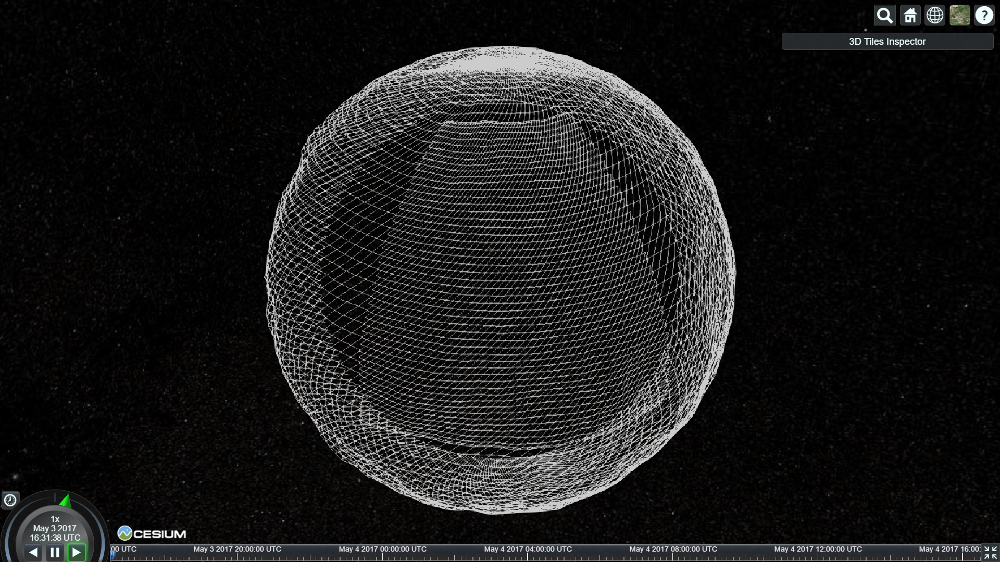

`Terrain Generation`

- For the terrain generation I am using a 3D multi octave lattice noise.

- Multi octave noise convolutes noise values or gradients specified at integer lattice points.

- For each pass/ octave the amplitude is reduced by a factor of the persistence and the sampling frequency is increased.

  - For higher octaves in the noise the corrosponding noise sampled becomes increasingly coarse, using this property of the lattice noise to my advantage I have used the distance of the tile as a metric to define the octaves of noise.

  - When the terrain is farther away from the camera the octaves will be less making the terrain smooth and as the camera comes closer the octaves will increase making the terrain more and more coarse and more defined.

- Finally the subdivided vertices of the tile are run through the 3D multi octave noise and are offset using the noise as as a height field value.

- Once the terrain is generated the geometry is then tessellated and the vertice, normal and indice information is packed into a buffer and sent to the shader to render using the `GLTF format`.

 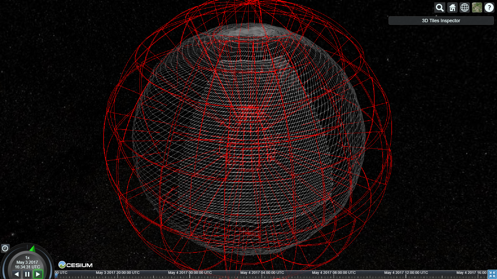

 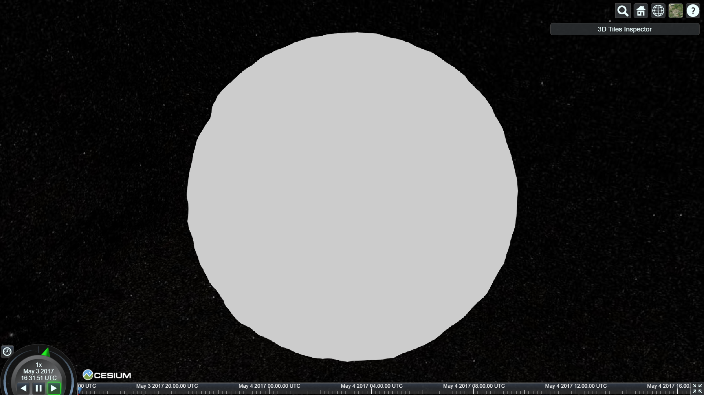

`Normals:` Using the same normals for the vertice points as before they were offsetted by the noise height field and storing them only once per vertex  will lead to flat shading as seen in the image above. To counteract this we calculate and store the normals per vertex per face which will produce the correct shading.

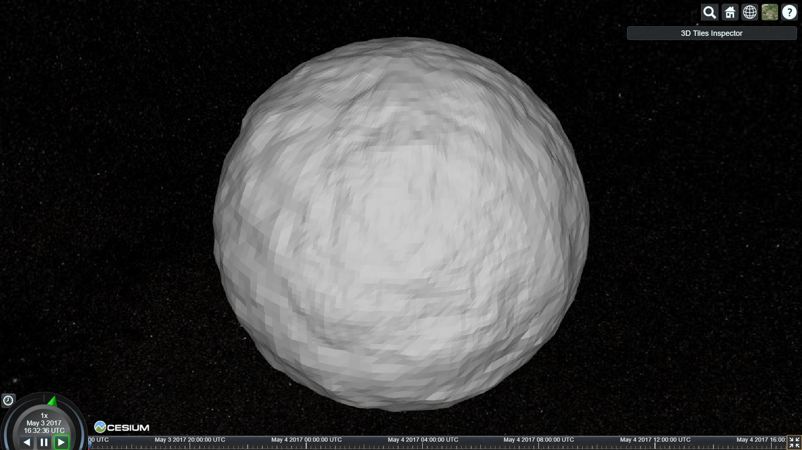

### Texture

The texture generation part involved exploration of different texturing techniques and fine-tuning the results to get realistic results. These techniques are described in this section.

The plan was to use multi-octave noise and fractals for the base texture, and add more variation using other techniques like voronoi diagrams. Fractals seemed to be a good option as we were dealing with increasing levels of detail. But as we decided to implement the texture in the fragment shader, I decided to use only multi-octave noise as changing levels of detail is not difficult to deal with in the shader. The final texture is a combination of multi-octave value noise and voronoi diagrams.

#### Multi-Octave Value Noise

This is what [Inigo Quilez](http://www.iquilezles.org/index.html) used in his demo [elevated]( https://www.shadertoy.com/view/MdX3Rr) for modeling the terrain and simulating erosion like effects.

Value noise is a noise generation technique much like Perlin noise. Value noise takes a pseudo random number as an input, and gives a noise value based on a quadratic, cubic, or quintic equation. The derivatives of the equation can be used as noise derivatives, which is useful in erosion simulation.

I modelled a terrain using ridged value noise in the vertex shader for testing the texture. Mapping the noise to the terrain gave the following result:

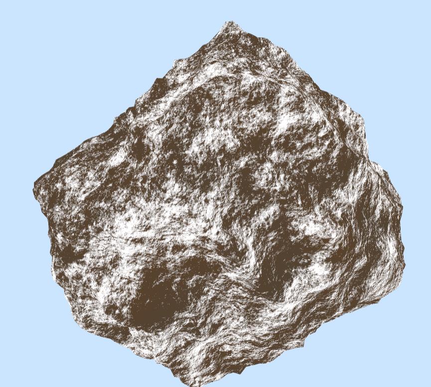

The presence of snow is determined by a combination of the height and the noise value at any point. The noise derivatives are used along with the noise to obtain the erosion/sliding of snow. I could not find much literature explaining the math behind the implementation of such effects, so I tweaked the values until it worked the way I thought it should. The derivative, in a way, should give the slope (change in noise) at the point. So, assuming it will show up more at high altitudes, it should flow down. Animating the implementation with time shows some such behavior. But I am not completely sure if that is how it really works.

#### Modifications to Value Noise

To add more detail to the terrain, I decided to explore some interesting techniques that work with pseudo-random noise, as I was computing value noise anyway.

**Ridged Value Noise:** It is a way of adding sharp ridges in an otherwise smooth value noise. The value of noise is in the range of [-1,1]. Absolute of noise flips the negative part to positive, creating a sharp discontinuity at 0. Subtracting this value from 1.0 inverts the resulting *graph*, producing sharp edges when viewed from top. The first image below is value noise and the second one is the corresponding ridged noise. I tried combining this with the original noise, but the results weren't convincing.

**Distorting textures using sine function:** It is a widely used method, where one inputs the noise value to the sine function. The results of this were also not very convincing. It looks like a marble texture which in no way could help me add details to the terrain texture.

#### Voronoi diagrams

Ridged noise and sine distortion having failed, I decided to give voronoi diagrams a try. They are used in many demos for modeling and shading rocks and terrain.

>In mathematics, a Voronoi diagram is a partitioning of a plane into regions based on distance to points in a specific subset of the plane. - Wikipedia

The voronoi diagram generated using the nearest of the sampled points, looks like this: 

Multiple voronoi diagrams with closest (V0), second closest(V1), ... points can be computed simultaneously and combined to get interesting results.  

V1 - V0 :  

V1 x V0 :  

> V1 x V0 when scaled down a lot, gives good enough details to add to the terrain. Currently, in the code, it is scaled down by 200 times. If finer details are needed, it can be scaled down more.

#### Blending the textures

These texturing methods are applied simultaneously and blended to get a final texture for fragments.

The base color (gray and brown) combined using noise:

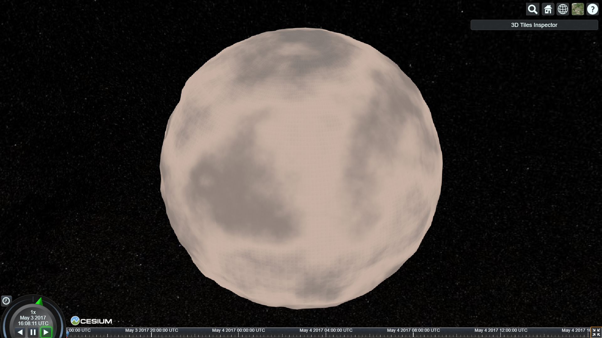

Adding more color (two shades of green) using offsetted noise to get more variation:

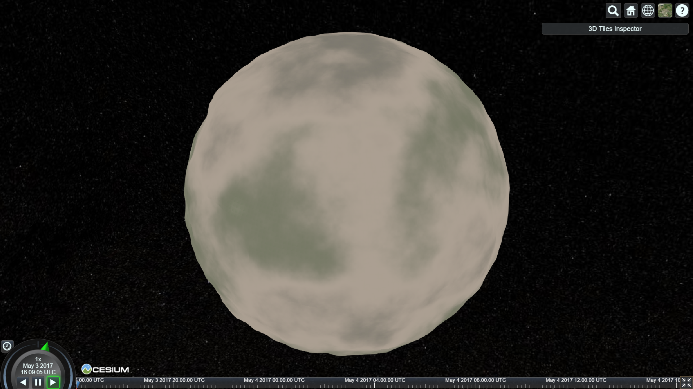

Adding voronoi (unevenly):

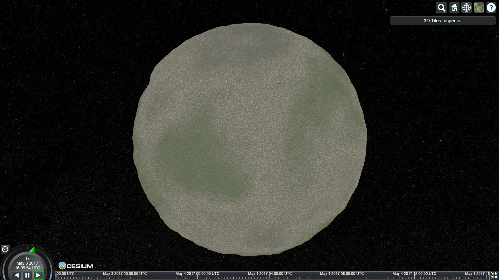

Adding snow (using the noise derivatives for fake erosion):

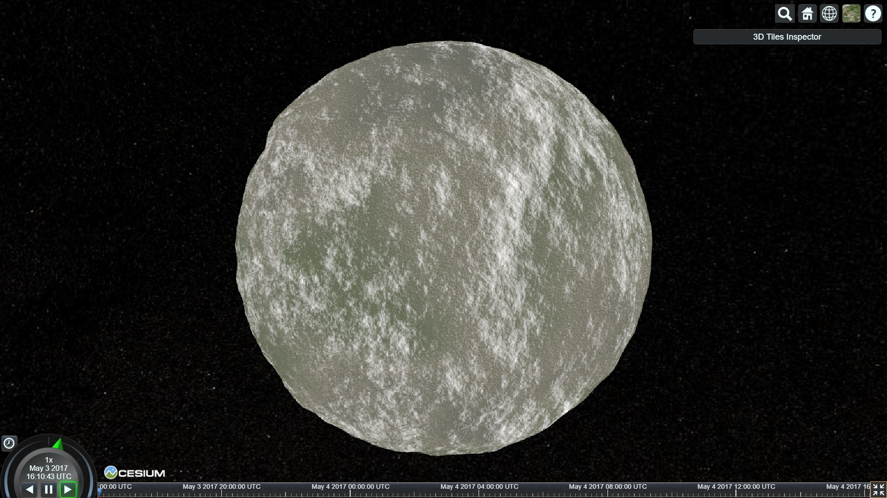

Diffuse shading:

------------------------------------

## Future Work

**Rudraksha**

- Given more time I would like to work on further optimizing the terrain generation by implementing the terrain inside the shader instead of the server.

**Rishabh**

- I would like to generate the terrain in the vertex shader using the same value noise algorithm. As this is a pseudo random noise, I can get the same values in the fragment shader and compute accurate height and noise derivatives to get better erosion effects. Currently, it is done using the noise that is not related to the height field. As a result, it does not look like as good as it does using the vertex shader I used for initial testing.

- I will also like to explore more types of terrains and their textures.

- Another interesting thing to explore would be generating weather effects like clouds, erosion due to wind, water, etc. Animation of such effects should be achievable using time variable in shader.

------------------------------------

## Acknowledgements

- Thanks to Austin for helping setup the server.

- Thanks to Austin and Rachel for helping understand the architecture of Cesium. Also for helping with developing an efficient way to generate the bounding boxes.

- Perlin noise reference: https://en.wikipedia.org/wiki/Perlin_noise

- Reference for terrain generation using noise:

  - http://www.redblobgames.com/articles/noise/introduction.html

  - http://www.iquilezles.org/www/articles/morenoise/morenoise.htm

  - http://www.iquilezles.org/www/articles/voronoise/voronoise.htm

  - http://www.iquilezles.org/www/articles/warp/warp.htm

- References for texturing:

    - Value noise by Inigo Quilez: http://www.iquilezles.org/www/articles/morenoise/morenoise.htm
    -
    - Basic lighting: https://www.opengl.org/sdk/docs/tutorials/ClockworkCoders/lighting.php
    - Gamma correction: https://learnopengl.com/#!Advanced-Lighting/Gamma-Correction
    - Voronoi diagrams:
        - GPU approach: http://nullprogram.com/blog/2014/06/01/
        - Intro to cell noise: http://www.carljohanrosen.com/share/CellNoiseAndProcessing.pdf
        - More cell noise: https://aftbit.com/cell-noise-2/

    - Terrain algorithms: http://www.decarpentier.nl/scape-procedural-basics
	- Paper on thermal erosion on GPU: http://old.cescg.org/CESCG-2011/papers/TUBudapest-Jako-Balazs.pdf
	- Cool ridge noise texture examples: http://www.inear.se/2010/04/ridged-perlin-noise/
	- Noise examples and techniques for textures: http://www.upvector.com/?section=Tutorials&subsection=Intro%20to%20Procedural%20Textures
    - Useful fractal formulae for planets towards the end: http://luthuli.cs.uiuc.edu/~daf/courses/computergraphics/week8/shading.pdf
    - Colors: Earth Tones: http://www.varian.net/dreamview/dreamcolor/earth.html
