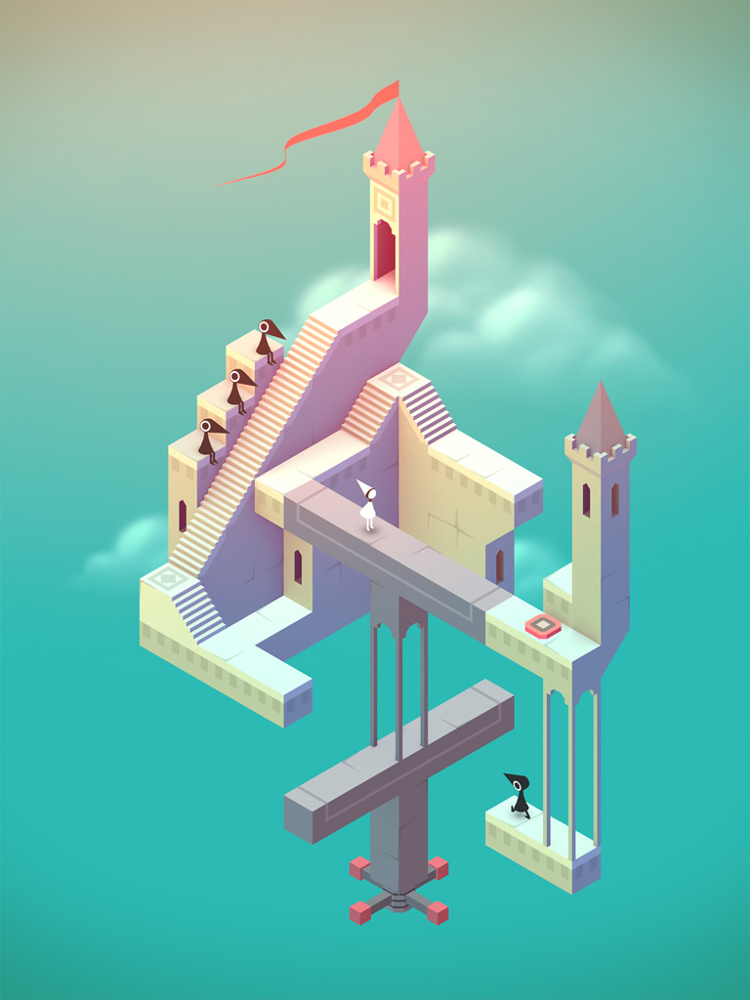
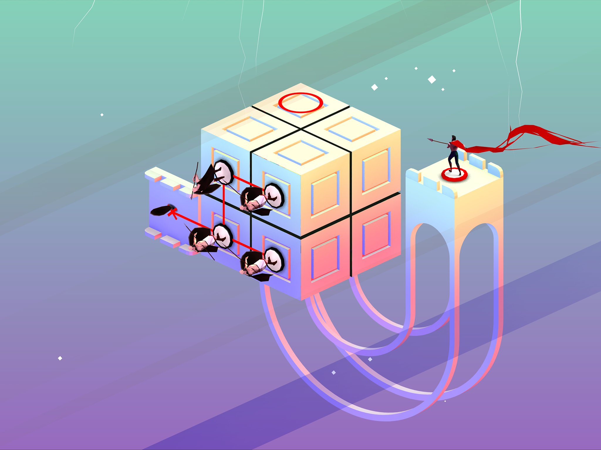
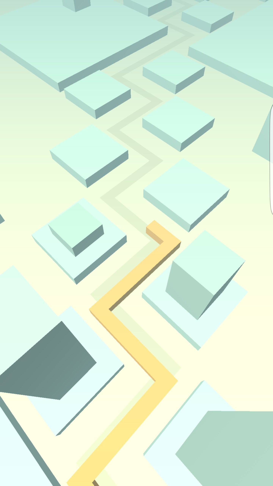

# CIS700 Procedural Graphics: Final Project

## Design Document:

  - ### Introduction
    * Always wanted to make a technically challenging and aesthetically pleasing puzzle game. Had this game idea written down, and has been sitting there for a solid year or so. Want to actually make this game happen. 

  - ### Goal
    * Create a challenging, addictive, isometric puzzle game using simple geometry and gradient colors. 

  - ### Inspiration
    * Monument Valley 

    
    
    * Euclidean Lands 

    

    * Dancing Line 
    
    

  - ### Specification
    * This procedurally-generated puzzle game has a simple objective: flip a cube from grid cell to grid cell until you reach the finish cell. Each grid cell can be one of six colors corresponding to the six distinct face colors of the cube. What makes this game challenging is that the current cell the cube is on must have the same color as the bottom face of the cube. Once the cube lands on a grid cell, the cell color turns grey and the player cannot go back. There will only be one path to the finish, so the player must plan his or her moves accordingly.

  - ### Techniques
    * The main technical challenge is generating each level. I have to make sure that each level has only one solution, and the path from start to finish is not a simple and straightforward line. In order to check that each level has only one solution, the alternative and incorrect paths cannot cannot provide the cube a way to walk back on the correct path. In a sense, this is a graph theory problem, where each vertex is a grid cell, and each edge is a possible path from grid cell to grid cell. As long as there are no cycles, there can only be one solution. Generating a windy and complicated solution is another beast to handle. Currently considering a Perlin Worms algorithm to generate the solution to each level, but this is subject to change. As the levels progress, the grid size will become bigger, making the level much harder. However, my algorithm should be flexible enough to generate a reasonable path for each grid size.

  - ### Design
    * Player Class: Class containing the state of the player, including the six faces and the direction the cube is facing.
    * Grid Class: Class containing the grid of grid cells, and a level generator to compute a reasonable puzzle for the player.
    * Main Class: Puts Cube and Grid class together, orchestrating the interaction between the two classes.

  - ### Timeline
    * April 18, 2017: Finish setting up the player and grid, be able to generate a path from start to finish, but do not have to fill in alternative paths yet.
    * April 25, 2017: Finish level generator with only a single solution to each level. Alternative, incorrect paths should be misleading to make the game difficult.
    * May 3, 2017: Polishing up the project. Fixing bugs, adding sound effects and animation, adjusting color pallette and aesthetics.

## Milestones:

  - ### Milestone 1
    * Finished setting up the player and grid class, where the player is able to rotate the cube using the arrow keys. For the player class, ran into the same problem with the turtle class in L-Systems project, where rotating the turtle using rotation.x, rotation.y, rotation.z has some issues. Still have to fix this by using quaternions instead. For the grid class, used Depth First Search to generate the whole level, instead of generating one single path. This part is currently operating, but will add more complexity to the Depth First Search level generation to make it more interesting.

  - ### Milestone 2
    * Fixed cube rotation by using quaternions instead of mesh.rotation. Found out that it is because there is a local rotation and world rotation for each THREE.Mesh that can be easily mixed up. Better to just use matricies in a scene graph style. Adjusted camera placement so that it is centered at the grid center, no matter what the dimensions of the grid is. Made multiple checks so that the cube can only flip if the color of the cube face that is going to face down matches the grid cell color. Added levels, where after crossing the finish cell, a new level appears with an increase in grid dimension. Realized that the plain Depth First Search level generation is too simple because on the edge of the grid, there is a 50 percent chance that it remains on the edge of the grid. Often the level generated has a easy path to the finish along the edge. Added a Gaussian Distribution Function to weigh the grid cells closer to the center more, so that the Depth First Search generator tends to go toward the center, making the level more complicated.

  - ### Milestone 3
    * Added a finish cell cube, or else a new player of the game doesn't know where the finish line is. Realized that the Depth First Search and Gaussian Distribution function level generator still does not work quite as expected. Now the level generator tends to go in a snake path, toward the center of the grid, then toward the edge, then toward the center again. Added a "throughput" that starts off as 1.0 and slowly decreases to 0.0 the more often the generator walks straight. This makes the paths generated more twisty and complicated. Added animation so that, to the player, it makes sense how the cube is flipping. Used a gain function to make the animation more realistic and lively. Added sound effects so that when the cube impacts on the ground, there is a "thump," and also added dream-like background music. Used raytracing so that the user no longer has to use arrow keys to move the cube. Instead, the user can use his or her mouse to select the grid cell to move to. Used cosine waves to procedurally generate the color for each level.

  - ### Final Tweaks
    * Changed the color of the raymarching grid cell selection depending if it is a movable grid cell or not. Realized that the game is too easy because the player can always move back if he makes a mistake, and there is no game over case. Made it so that once the user steps off a grid cell, the grid cell falls into an abyss. No more take-back-sies. If the user is stuck, he or she must take his or her own life by jumping into the abyss. Then it is game over. Added a start menu and game over screen so that there actually is a clear/definite start and end to the game. Made it so that not only does the grid dimension increase as the levels get harder, but also adjusted the throughput value so that the level generated paths are more windy as the levels get harder.

## Final Report

  - ### Introduction
    * Always wanted to make a technically challenging and aesthetically pleasing puzzle game. Had this game idea written down, and has been sitting there for a solid year or so. Want to actually make this game happen. 

  - ### Goal
    * Create a challenging, addictive, isometric puzzle game using simple geometry and gradient colors. 

  - ### Inspiration
    * Monument Valley 

    
    
    * Euclidean Lands 

    

    * Dancing Line 
    
    

  - ### Specification
    * This procedurally-generated puzzle game has a simple objective: flip a cube from grid cell to grid cell until you reach the finish cell. Each grid cell can be one of six colors corresponding to the six distinct face colors of the cube. What makes this game challenging is that the current grid cell the cube is on must have the same color as the bottom face of the cube. Once the cube lands on a grid cell, the previous grid cell falls into an abyss and the player cannot go back. The player must plan his or her moves accordingly. In essence, this game is a maze without walls, but colors. 

  - ### Techniques
    * Level Generation: 
    * Procedural Color:
    * Raymarching:
    * Animation:

    The main technical challenge is generating each level. I have to make sure that each level has only one solution, and the path from start to finish is not a simple and straightforward line. In order to check that each level has only one solution, the alternative and incorrect paths cannot cannot provide the cube a way to walk back on the correct path. In a sense, this is a graph theory problem, where each vertex is a grid cell, and each edge is a possible path from grid cell to grid cell. As long as there are no cycles, there can only be one solution. Generating a windy and complicated solution is another beast to handle. Currently considering a Perlin Worms algorithm to generate the solution to each level, but this is subject to change. As the levels progress, the grid size will become bigger, making the level much harder. However, my algorithm should be flexible enough to generate a reasonable path for each grid size.

  - ### Design
    * Player Class: Class containing the state of the player, including the six faces and the direction the cube is facing.
    * Grid Class: Class containing the grid of grid cells, and a level generator to compute a reasonable puzzle for the player.
    * Main Class: Puts Cube and Grid class together, orchestrating the interaction between the two classes.

  - ### Timeline
    * April 18, 2017: Finish setting up the player and grid, be able to generate a path from start to finish, but do not have to fill in alternative paths yet.
    * April 25, 2017: Finish level generator with only a single solution to each level. Alternative, incorrect paths should be misleading to make the game difficult.
    * May 3, 2017: Polishing up the project. Fixing bugs, adding sound effects and animation, adjusting color pallette and aesthetics.

  - #### Results:
    * Provide images of your finished project

  - ### Evaluation (this is a big one!):
    * How well did you do? What parameters did you tune along the way? Include some WIP shots that compare intermediate results to your final. Explain why you made the decisions you did.

  - ### Future work:
    * Given more time, what would you add/improve

  - ### Acknowledgements:
    * Special thanks to Rachel Hwang, Adam Mally, Sally Kong, Trung Le, and Austin Eng for being so supportive throughout the semester and especially throughout this project.

