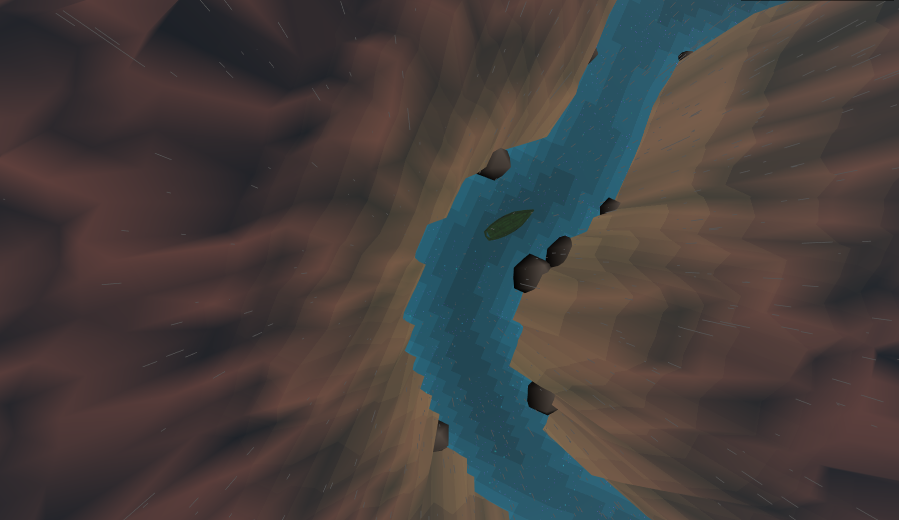
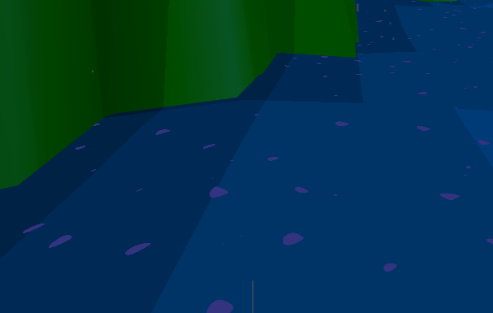
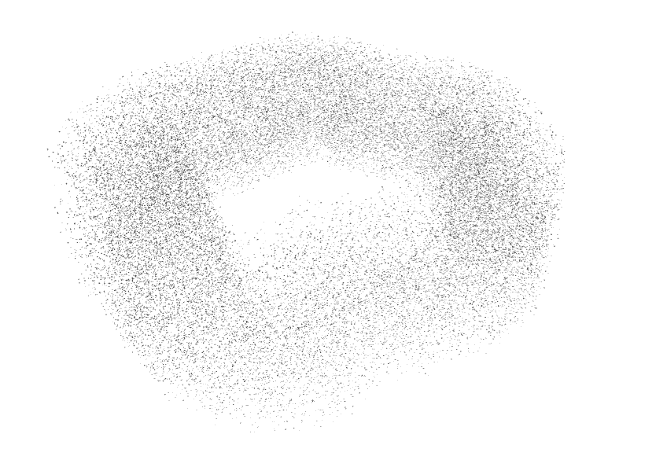

# Zionical

This project is inspired by [Panoramical][1], a musical landscape with highly abstracted and colorful environments. 

## Results

I am very happy with how this project turned out, not just visually but implementation-wise. I unintentionally incorporated topics from various different lectures, not just the noise lecture as was the original intent. I used a particle system, cosine color palettes, toolbox functions, and of course lots of noise and shaders.  

  

## Evaluation

### Sky
perlin noise
toon shading
spherical map

### Camera

The camera and canyon are closely tied together because the camera can only move through empty space in the canyon (aka not move through rocks), so the implementations had to be connected. I decided to first define a camera animation along a closed spline. I could have first started with defining the canyon gorge layout and then add the camera movement inside, but this seemed more difficult to me because if I laid spline knots in the gorge, I could not be guaranteed that all interpolated spline points would remain in the gorge. I chose a spline because I wanted to have a continuous animation, which I could achieved with a closed loop, but I also wanted the path to twist and turn so as not to be an obvious circle. By offsetting the knot points pseudo-randomly, I am able to perturb the path just enough to appear random but not too jerky, since it is still controlled by a smooth curve. Below are some examples of the generated splines. 

   

While the paths appear relatively circular, the terrain is large enough that the circular nature is not noticed. The spline is controlled by a smoothness factor along with a maximum radius which insures that the spline fits within the terrain plane and that the spline never gets too close to the edge so that it always has a canyon wall. The smoothness parameter controls how much each subsequent spline know can change in radial distance from the previous. When smoothness = 0, the spline is a circle and when smoothness = 1, the spline can flucuate as much as half its maximum radius between know points. Any more perturbation would cause the camera to jerk since the spline points become less smooth.

### Canyon

| Low Resolution  | High Resolution | Gaussian Blur | Widened |
| -----------| ---------- | ------- | ------- |
|  |  |  |  |

### Water

### Rain
After implementing the water, canyon, and camera movement, I had achieved the basic effects I was going for, but I wanted to add more movement, so I decided to create inclement weather. Since a lot of my effects were done in shaders, I considered creating a post-processing rain shader, but decided that a particle system in THREE.js would look better and achieve depth of cues better. 

Rain dynamics are pretty simple. Originally each rain droplet fell at a constant velocity in the negative y direction. The effect looked like rain, but slightly off. I realized that it would be easy to implement a more realistic dynamic system with gravity, but adding gravity, I reduced the effect with wind drag for added realism and so that the particles didn't get too fast between frames. The wind drag is achieved by clamping the velocity to a max speed rather than solving a differential equation.

Particle systems can be quite costly. In order to keep the simulation at runtime, I used the same terrain map generated from the camera spline to spawn particles. Particles are only created within the confines of the gorge. Once the particles reach y = 0, their position and velocity are reset to their original - or similar - values (saved in the particle struct). The droplets were drawn with THREE.LineSegments such that the endpoints were the particle's position and small offset from this position in the velocity direction. This creates a constant number of particles in a looped cloud (Figure 1). The problem with this approach is that all the line segment in the THREE geometry have the same thickness and random length. There is not way to attentuate based on distance from the camera.

Particle systems can be quite costly. In order to keep the simulation at runtime, I used the same terrain map generated from the camera spline to spawn particles. Particles are only created within the confines of the gorge. Once the particles reach y = 0, their position and velocity are reset to their original - or similar - values (saved in the particle struct). The droplets were drawn with THREE.LineSegments such that the endpoints were the particle's position and small offset from this position in the velocity direction. This creates a constant number of particles in a looped cloud (Figure 1). The problem with this approach is that all the line segment in the THREE geometry have the same thickness and random length. There is not way to attentuate based on distance from the camera. 

The next rain effect I implemented was the rain hitting the water. I do not handle rain hitting the canyon walls because the effect is less noticeable at the grazing angle the rain hits the walls. Going with the overall theme of "effects created with noise functions", I first created small splashes on the water with high frequency perlin noise, coloring pixels above a certain threshold in the water's fragment shader. Once again, this effect was okay, but slightly off because the spots on the water surface were not always circular and because rather than appear and fade away, the spots seemed to morph together and away (Figure 2).  

To fix the raindrop thickness and the droplet splashes, I moved this code to a rain shader. Instead of creating a line segment geometry, I instance a polygon at each particle position. When the particle is above the water (code for perlin noise for water copied in the rain's vertex shader), the polygon becomes a triangle with the thickness of the bottom dependent on distance from camera and the color is grey. When the particle is below the water, the polygon becomes a hexagon with a radius dependent on the distance below the water. The color of these droplets is interpolated between purple and the color of the water so that they disappear over time. The transparency of both the rain droplets and splashes increases in proportion to the distance from the camera. 

### Fog
The rain in the distance can barely be differentiated due to the distance from the camera. In order to bring back the effect of the rain, I add fog in the distance, using [iq's glsl fog] [2]. I use simple fog with exponential drop off. The scattering fog that iq discussed would not make much sense in a scene with no concept of a light location. The images below depict the selection of the b coefficient which controls how much the fog falls off, and thus how "foggy" the scene appears.

| b  | 0.0 | 0.035 | 0.1 |
| -----------| ---------- | ------- | ------- |
| |  |  |   |

### Rocks

### Boat
The addition of the boat has little procedural meaning. I added it because the scene felt empty. Its movement and rotation mimics the camera's. 

### Music
I did not like the effect the music frequency had in my scene. I set the frequency of the perlin noise to the music frequency, but I found the effect to be to inconsistent and jarring in the sky and the water. Instead I used the music to pulse the rocks. 

## Future Work

* Camera Movement: I would like to improve the interactivity beyond just the viewpoint toggle. Instead of animating the camera along a spline, the user could move anywhere within the widened spline loop area and look around the scene. When that gets boring, the camera would move back to the spline animation. 
* Changing Weather: The simulation started as a sunny canyon environment until I added the rain particles. It would be cool for the simulation to smoothly change from sunny to rainy to stormy, etc. The problem with this now is dynamically adding particles to the system.  
* Ambient Occlusion: Since this project achieves all effects without light, an ambient occlusion post processing effect could really improve the quality of the final render. Ambitious me thought [this][3] would be really cool, but I did not have enough time to understand and implement.

## Acknowledgements

* [Realtime Procedural Terrain Generation][2] 
* Perlin Noise and [Simplex][3] Noise 
* [Diamond-square algorithm][4]
* [Fractal landscape][5]

[1]: https://vimeo.com/88946422
[2]: http://www.iquilezles.org/www/articles/fog/fog.htm
[3]: http://www.iquilezles.org/www/articles/multiresaocc/multiresaocc.htm