# Zionical

This project is inspired by [Panoramical][1], a musical landscape with highly abstracted and colorful environments. 

## Results

I am very happy with how this project turned out, not just visually but implementation-wise. I unintentionally incorporated topics from various different lectures, not just the noise lecture as was the original intent. I used a particle system, cosine color palettes, toolbox functions, and of course noise and shaders.  

  

## Evaluation

### Sky
perlin noise
toon shading
spherical map

### Camera
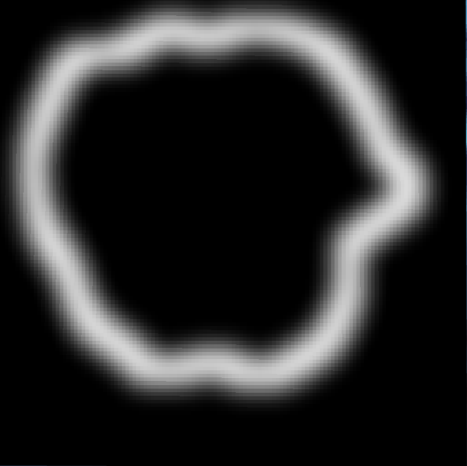 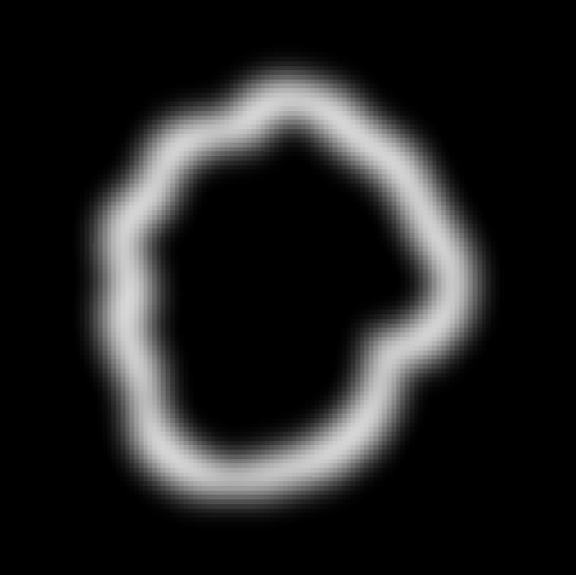 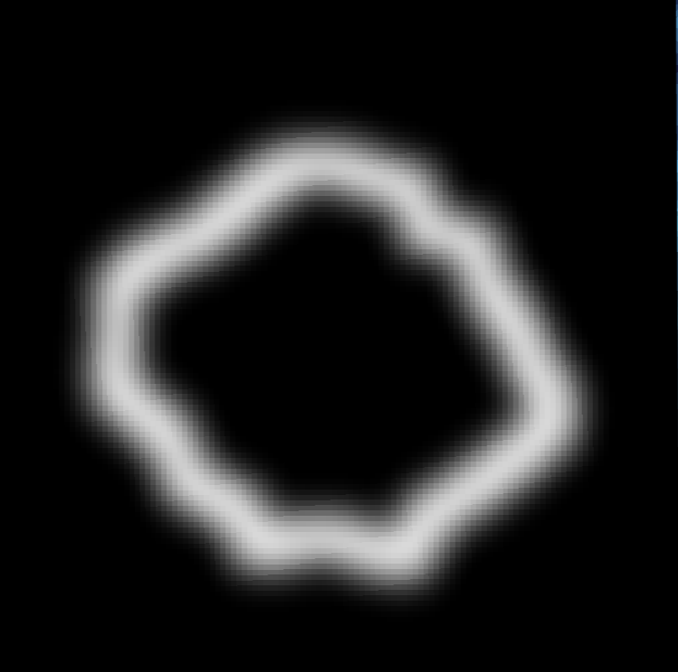

### Canyon
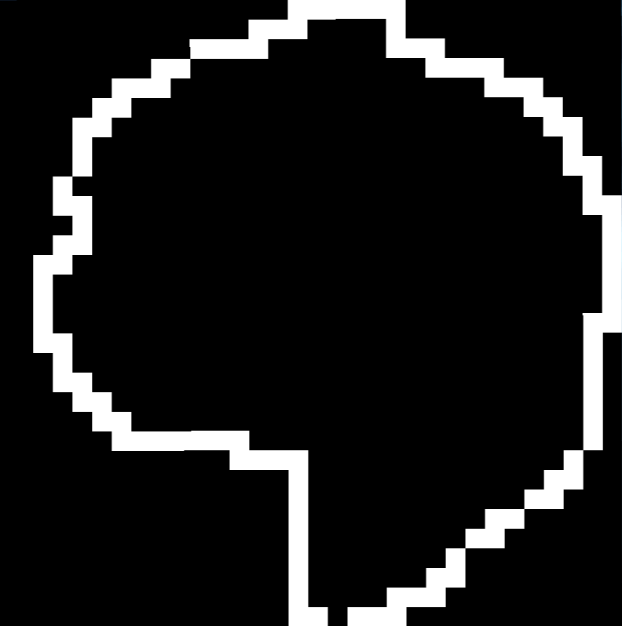 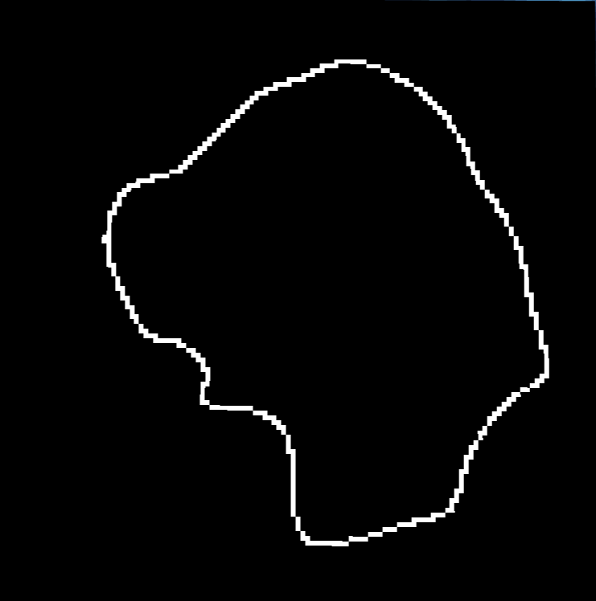 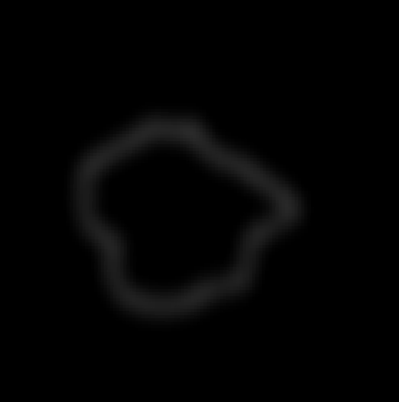 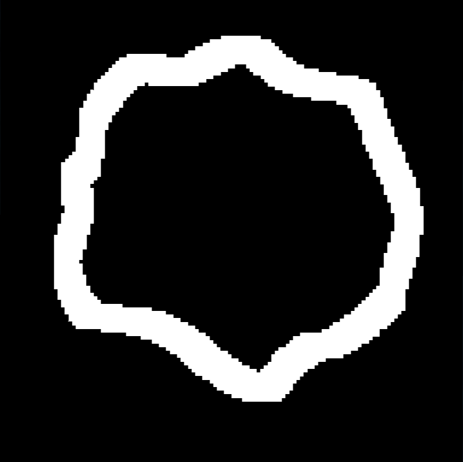

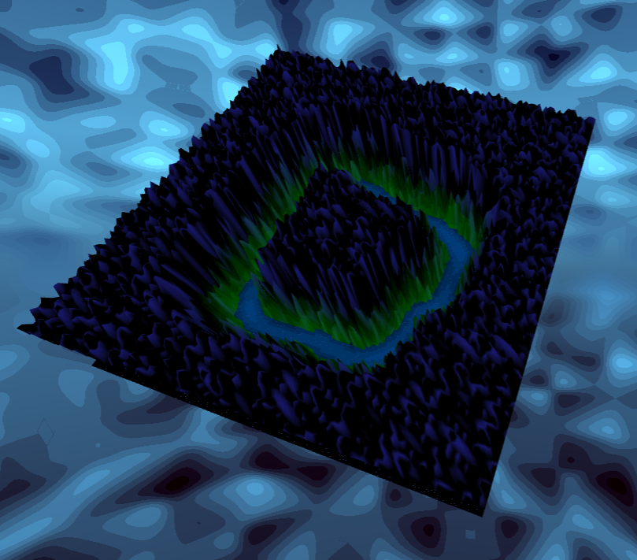

### Water

### Rain

### Fog
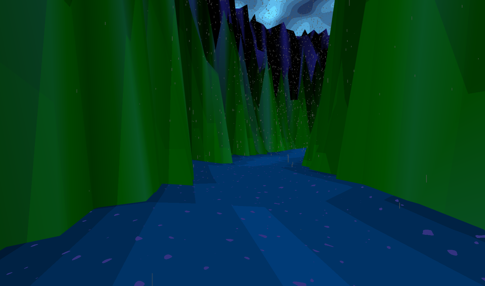 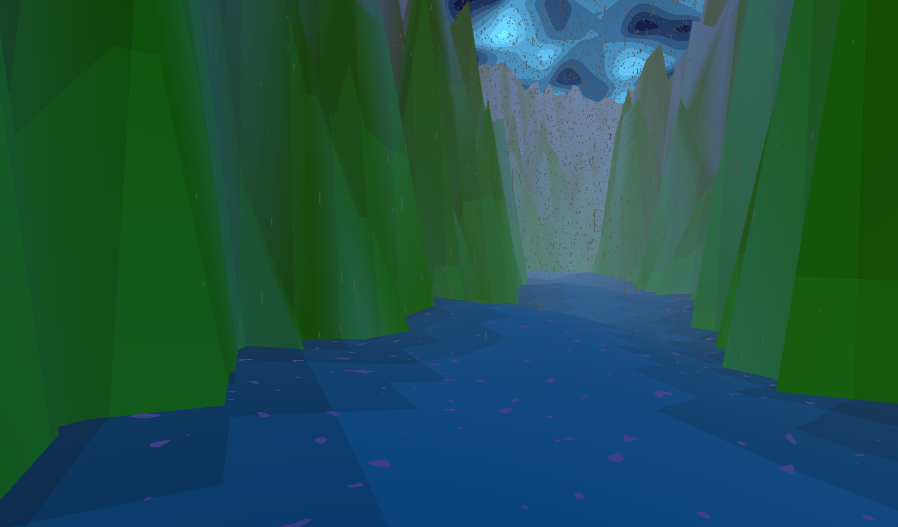 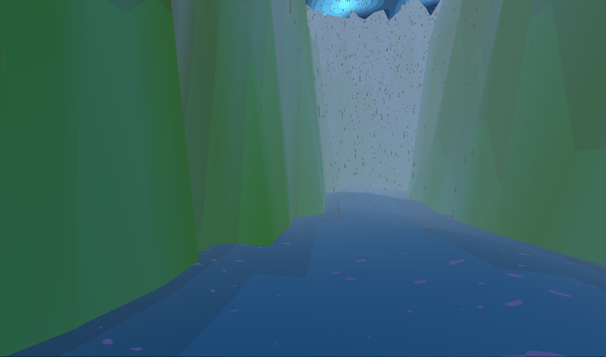

### Rocks

### Boat

### Music

## Future Work

* camera movement within the scene, scene intersection (rain "hits" wall)
* change weather from sunny to rainy and back
* smoother camera movements  
* create rain and ambient occlusion as post processing effect

## Acknowledgements

* [Realtime Procedural Terrain Generation][2] 
* Perlin Noise and [Simplex][3] Noise 
* [Diamond-square algorithm][4]
* [Fractal landscape][5]

[1]: https://vimeo.com/88946422
[2]: http://web.mit.edu/cesium/Public/terrain.pdf
[3]: http://webstaff.itn.liu.se/~stegu/simplexnoise/simplexnoise.pdf
[4]: http://stevelosh.com/blog/2016/06/diamond-square
[5]: http://paulbourke.net/fractals/noise/