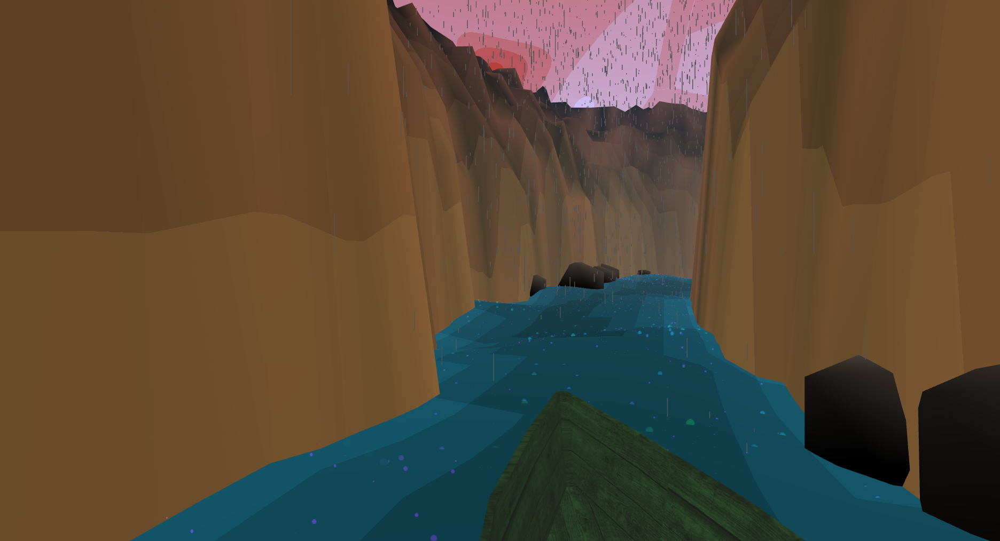
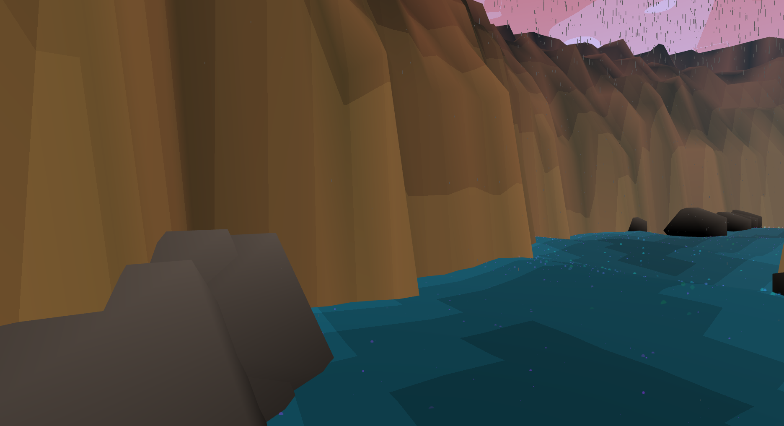
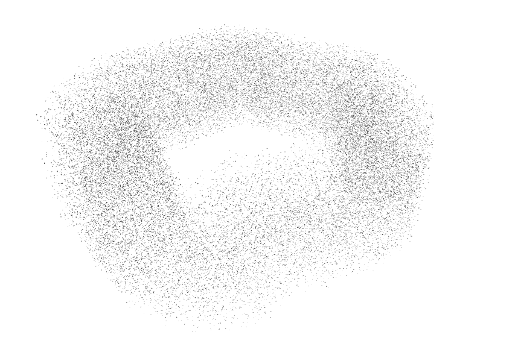
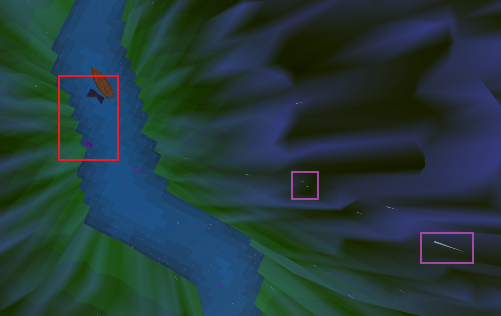

# Zionical

This project is inspired by [Panoramical][1], a musical landscape with highly abstracted and colorful environments. 

Press "V" for viewpoint change.

Press "P" to pause;

## Results

 

I am happy with how this project turned out, not just visually but implementation-wise. I unintentionally incorporated topics from various different lectures, not just the noise lecture as was the original intent. I used a particle system, cosine color palettes, toolbox functions, filters, and of course lots of noise and shaders. 

## Evaluation

### Sky
The sky is a sphere surrounding the scene with a perlin noise fragment shader. The noise value is bucketed to create a toon shader effect. 

|  | 
| --------------------------------------- |
| Figure 1: Toon shaded Perlin Noise |

### Camera

The camera and canyon are closely tied because the camera can only move through empty space in the canyon (aka not intersect the rocks), so the implementations had to be connected. I decided to first define a camera animation along a closed spline. I could have started with the canyon gorge layout and then add camera movement within, but this seemed more difficult because if I placed the spline knots in the gorge, all interpolated points were not guaranteed to remain in the gorge. I chose a spline because I wanted to have a continuous animation, which I could achieved with a closed loop, but I also wanted the path to twist and turn so as not to be an obvious circle. By offsetting the knot points pseudo-randomly, I am able to perturb the path just enough to appear random but not too jerky, since it is still controlled by a smooth curve. Figure 2 shows some examples of procedurally generated splines. 

|  		 		 |
| ----------------------- |
| Figure 2: Perturbed circular splines |

While the paths appear relatively circular, the terrain is large enough that the circular nature is not noticed. The spline is controlled by a smoothness factor and a maximum radius which insures that the spline never gets too close to the edge and always has a canyon wall. The smoothness parameter controls how much each subsequent spline knot can change in radial distance from the previous. When smoothness = 0, the spline is a circle and when smoothness = 1, the spline can flucuate as much as half its maximum radius between knot points. Any more perturbation would cause the camera to jerk.

In addition to the warped spline, the camera uses a unperturbed circle for the animation of the bird's eye viewpoint. This is because the turning of the camera along the spline was too noticable when looking down the y axis. For the third person viewpoint, the camera position is offset backwards and upwards from the spline position (relative to the boat).

### Canyon
Once I had the camera animated, I needed to create canyon walls surrounding the spline. I first attempted to use seperate planes for the left and right sides and move the planes with the camera. This was unnecessarily complicated to orchestrate and moving the planes and updating the noise made the canyon look alive, not rock-like. I also was not sure how to make the rock faces look more sheared than bumpy. I changed the canyon to have noise in the world +y direction. Using the camera spline described above, I created an image texture to pass to the vertex shader defining where the gorge and cliffs are located on the plane. I achieved this by iterating through the spline points and creating a texture where the value was maximum on the spline and zero everywhere else. I increased the resolution of the texture and applied a gaussian blur in both the x and y directions to create tapered cliffs rather than a box cut off. This created a very shallow passage since now fewer values were maximum, so I widened the path before applying a gaussian blur by filtering the image by the maximum value in a local texel area. See Figure 3 for a pipeline of the filters used. 

| Low Resolution  | High Resolution | Gaussian Blur | Widened |
| -----------| ---------- | ------- | ------- |
|  |  |  |  |
Figure 3: Filters

 The height is proportional to the value of the texture. To create the striation of cliff walls, the texture value is bucketed before a noise value is added. Figure 4 shows the effect of the spline texture and filters in the scene.

|  |
| --------------------------------- |
| Figure 4: Spline gorge |

### Water
The water similarly relies on the spline texture to create a water depth map where the middle of the river is darker (deeper) than the edges. The values could be interpolated smoothly from dark to light, but I liked the pixelated effect from the low resoluation of the texture. It goes with my overall theme. The water is also animated with Simplex noise.  

### Rain
After implementing the water, canyon, and camera movement, I had achieved the basic effects I was going for, but I wanted to add more movement, so I decided to create inclement weather. Since a lot of my effects were done in shaders, I considered creating a post-processing rain shader, but decided that a particle system in THREE.js would look better and achieve depth cues better. 

Rain dynamics are pretty simple. Originally each rain droplet fell at a constant velocity in the negative y direction. The effect looked like rain, but slightly off. I realized that it would be easy to implement a more realistic dynamic system with gravity and wind drag for added realism and so the particles do not get too fast between frames. The wind drag is achieved by clamping the velocity to a max speed rather than solving a differential equation.

Particle systems can be quite costly. In order to keep the simulation at runtime, I used the same terrain map generated from the camera spline to spawn particles. Particles are only created within the confines of the gorge. Once the particles reach y = 0, their position and velocity are reset to their original - or similar - values (saved in the particle struct). The droplets are drawn with THREE.LineSegments such that the endpoints are the particle's position and a small offset from this position in the velocity direction. This creates a constant number of particles in a looped cloud (Figure 5). The problem with this approach is that all the line segment in the THREE geometry have the same thickness and random length. There is no way to attentuate based on distance from the camera.

|  | 
| ------------------------------ |
|Figure 5: Particles confined to camera's spline region |

The next rain effect I implemented was the rain hitting the water. I do not handle rain hitting the canyon walls because the effect is less noticeable at the grazing angle the rain hits the walls. Going with the overall theme of "effects created with noise functions", I first created small splashes on the water with high frequency perlin noise, coloring pixels above a certain threshold in the water's fragment shader. Once again, this effect was okay, but slightly off because the spots on the water surface were not always circular and because rather than appear and fade away, the spots seemed to morph together (Figure 7A).  

To fix the raindrop thickness and the droplet splashes, I tried moving this code to a rain shader. Instead of creating a line segment geometry, I tried instancing a polygon at each particle position. When the particle is above the water (code for perlin noise for water copied in the rain's vertex shader), the polygon becomes a triangle with the thickness of the bottom dependent on distance and angle from camera and the color is grey. When the particle is below the water, the polygon becomes a hexagon with a radius dependent on the distance below the water. The color of these droplets would be interpolated between purple and the color of the water so that they disappear over time. Figure 6 shows an attempt at this method. 

|  |
| ---------------------------- |
| Figure 6: Droplet implementation in vertex shader |

While in theory it is a great idea, instancing in THREE.js is not perfected according to other users (and confirmed by me). The types of geometry that can be instanced and the possible shader effects are too limited. I was able to make triangular water droplets whose lengths were dependent on the viewing vector (shorter when seen from above) using a regular buffer geometry - not instanced (see purple squares in Figure 6). However my GPU could not handle very many triangles because every call required multiple if-statements to determine shape and location. In additon, creating a circular splash required moving specific vertices outward, so each vertex required an extra attribute for identifying its location on the polygon. In the end it just looked bad and ran slowly, so I changed back to the line segments. 

I improved the water splashes by creating particles at all locations on the animated water plane where a rain drop appear above (Figure 7B). The particle shader uses a texture to define the shape. I used a simple circle, but a more sophistacated splash could also be used. Then the size and color of each was animated with a high frequency noise. The images below show this improvement (left: noise filtered color, right: particles). The color is interpolated between my color of choice (purple) and the color of the water at the point so the drops fade away.

|   |
| --------------------------- |
| Figure 7: Rain droplet splashes (A: original perlin noise implementation; B: particles) |

### Fog
The rain in the distance can barely be differentiated due to the distance from the camera. In order to bring back the effect of the rain, I add fog in the distance, using [iq's glsl fog] [2]. I used simple fog with exponential drop off. The scattering fog that iq discusses would not make much sense in a scene with no concept of a light location. The images below depict the selection of the b coefficient which controls how much the fog falls off, and thus how "foggy" the scene appears.

| b  | 0.0 | 0.035 | 0.1 |
| -----------| ---------- | ------- | ------- |
| |  |  |   |

Figure 8: Fog Parameter b

### Rocks
The rocks were originally going to be instances of one geometry, but creating seperate meshes did not slow down the simulation and instancing does not work (see discussion in rain section above). The geometries are icosahedron and dodecahedrons with lambert shading for a "basic" effect. The rocks are randomly placed along the camera spline, and then moved to the edges of the canyon so that the boat does not run into them. Essentially, the rock's position is incrementally increased or decreased in the X or Z direction until the value in the spline texture falls below a threshold value.   

### Boat
The addition of the boat has little procedural meaning. I added it because the scene felt empty. Its movement and rotation mimic the camera's. The user can add and remove it to the scene with the GUI. 

### Music
I did not like the effect the music frequency had in my scene. I set the frequency of the perlin noise to the music frequency, but I found the effect to be to inconsistent and jarring in the sky and the water. I also used the music to pulse the rocks. Did not like that either because the scene is calm and soothing and the frequencies are just not. 

## Future Work

* Camera Movement

I would like to improve the interactivity beyond just the viewpoint toggle. Instead of animating the camera along a spline, the user could move anywhere within the widened spline loop area and look around the scene. When that gets boring, the camera would move back to the spline animation.

* Rain running down Canyon

I am thinking of some sort of shader (nothing physical) to create streaks of water running down the conyon walls. 

* Changing Weather

The simulation started as a sunny canyon environment until I added the rain particles. It would be cool for the simulation to smoothly change from sunny to rainy to stormy, etc. The problem with this now is dynamically adding particles to the system. 

* Ambient Occlusion

Since this project achieves all effects without light, an ambient occlusion post processing effect could really improve the quality of the final render. Ambitious me thought [this][3] would be really cool, but I did not have enough time to understand and implement.

## Acknowledgements

* [Advanced Value Noise][5] by iquilezles
* [Better Fog][2] by iquilezles
* [Simplex Noise][4] by Stefan Gustavson 

[1]: https://vimeo.com/88946422
[2]: http://www.iquilezles.org/www/articles/fog/fog.htm
[3]: http://www.iquilezles.org/www/articles/multiresaocc/multiresaocc.htm
[4]: http://webstaff.itn.liu.se/~stegu/simplexnoise/simplexnoise.pdf
[5]: http://www.iquilezles.org/www/articles/morenoise/morenoise.htm