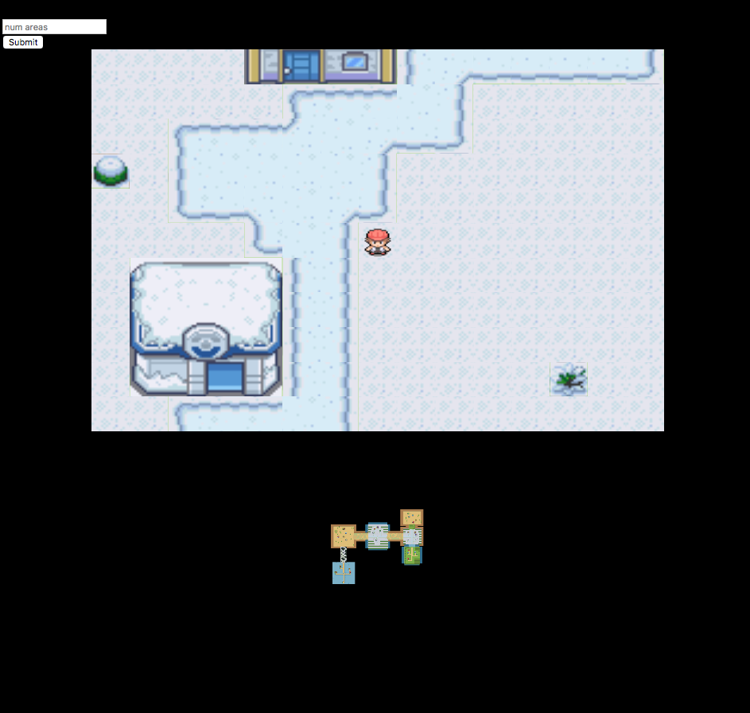
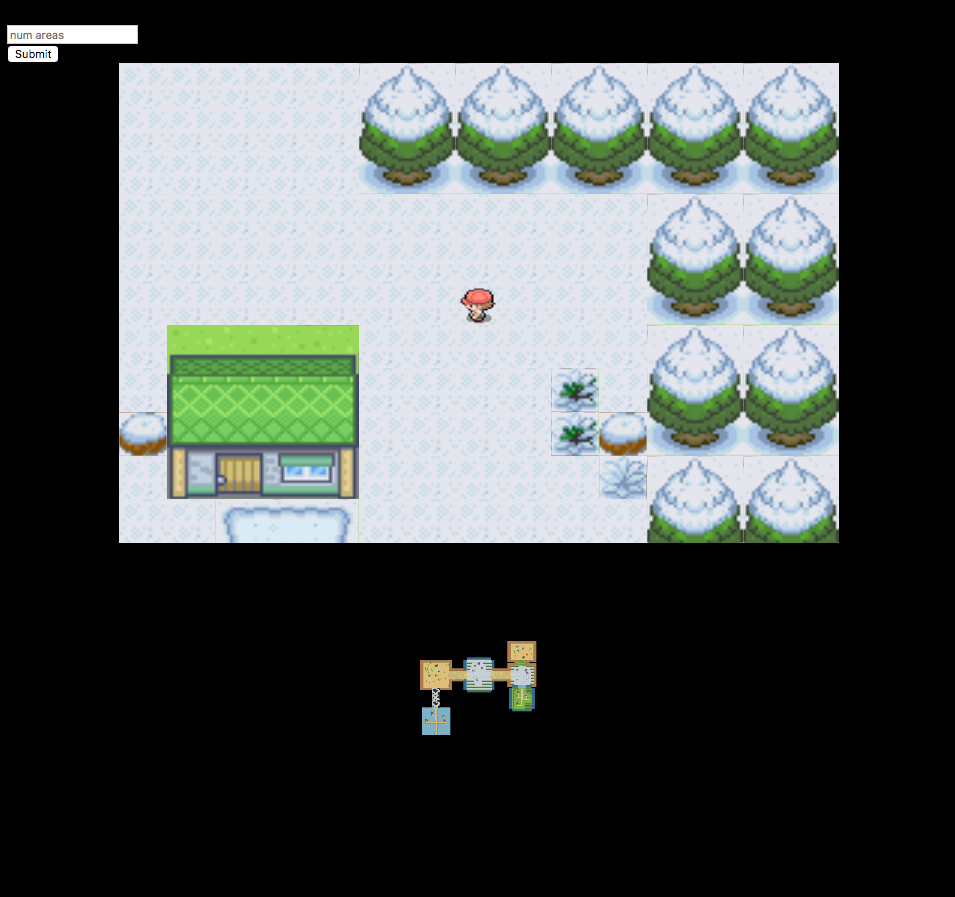
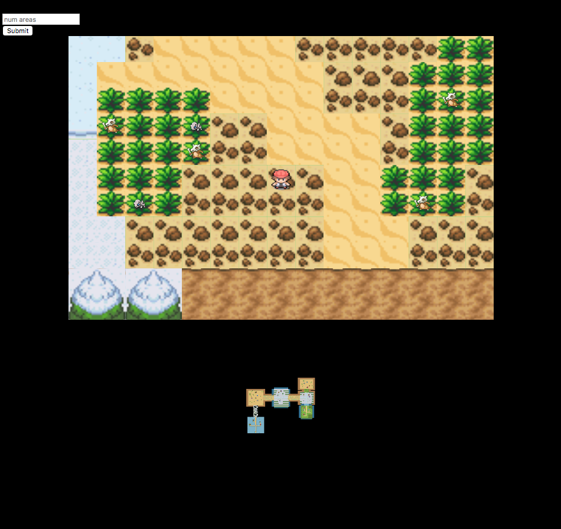
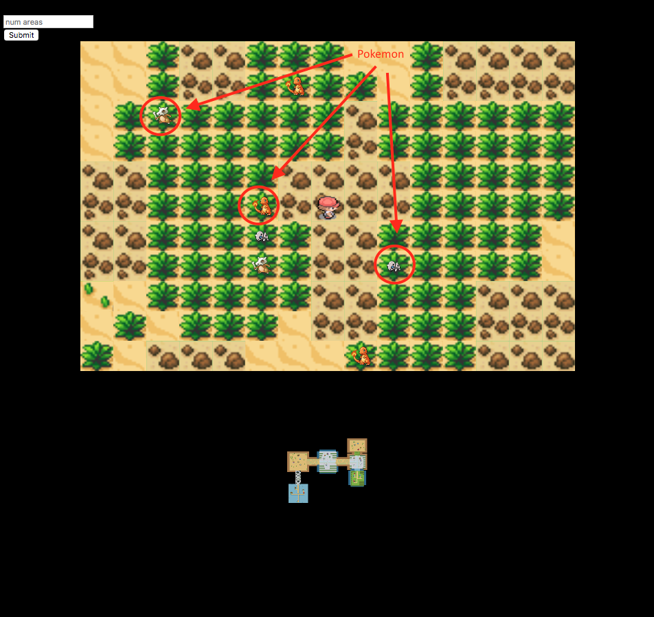
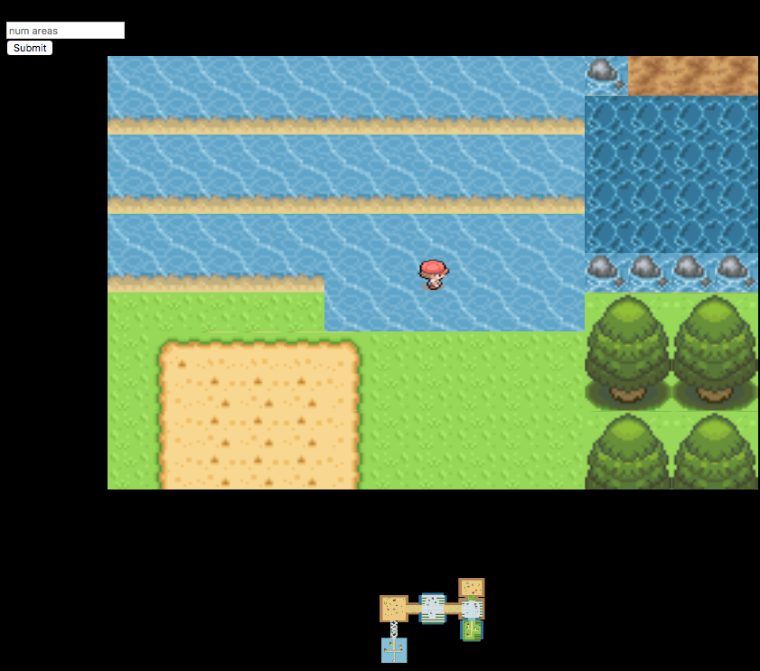
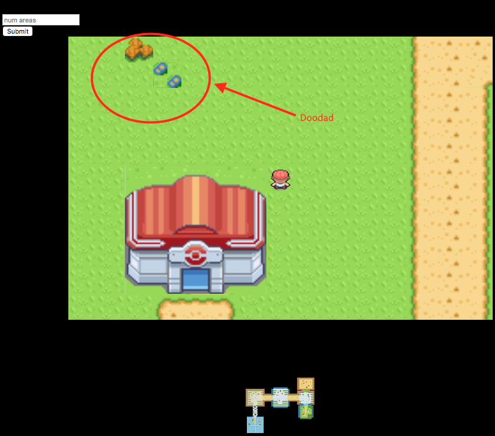
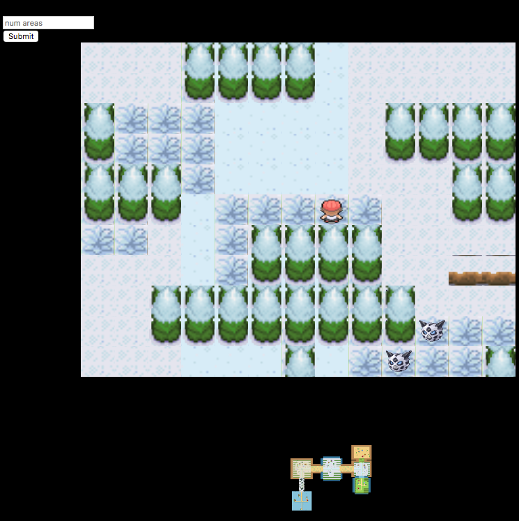
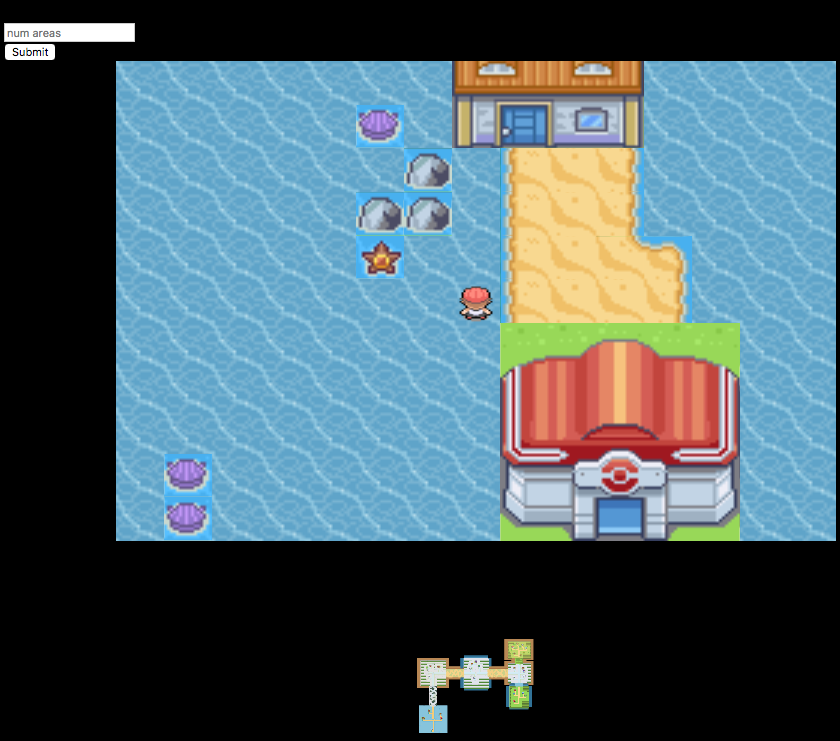

# Procedural Pokemon
[Demo](https://davlia.github.io/procedural-pokemon)
[Video](https://clips.twitch.tv/VibrantEasyDiscMcaT)

## Final Report
### David 
- Implemented logic for populating an area with buildings, roads, doodads, etc. based on a biome
- Implemented logic for populating a vertical route with bushes, trees, ledges based on a biome
- Updated the player sprite to face the correct direction when moved
- Added in ability for an area to regenerate (based on some random probability) once a user leaves that area
- Implemented the minimap! :D
- Networking things

### Joseph
- Removed previous algorithm for area generation (Minimum spanning tree based algorithm), and reimplemented area generation and connection using a probabilistic DFS method with specific rules so we don't accidentally generate new areas over old areas
- Implemented logic for definding specific area bounds and attributes (entry/exit points based on where routes intersect an area, etc.) and generating believable terrain borders in non-playable areas
- Added in ability to change the number of areas generated (must not have anyone else in the map with you, otherwise the server gets sad)
- Adapted David's vertical route logic to work with horizontal routes

### Both
- Updated sprite sheets
- Many, many, many refactors

## Design Document

### Goal
Our goal for the final project of CIS 700-006 is to procedurally generate an interactive 2D Pokemon map that contains a number of 'Pokemon-Go' like features. The 2D world will be a grid-based map, where each 'block' of the grid corresponds to an explorable area. The blocks will each be themed to a specific biome, and the twist of this game is that when a player leaves a certain block and returns to that same block, the block will have changed its terrain based on some rule (currently, planning to cycle through the biomes in a random order). In addition, each biome will feature the original sprites for grass, trees, dirt, snow, etc., in order to recapture the authentic feel of the beloved Pokemon universe. Finally, we plan to rip off the original 150 Pokemon sprites from a 'trusted' resource, and randomly spawn these pokemon in 'wild pokemon areas' of the blocks (randomly determined in each block), where the pokemon available for spawn are determined by the specific biome (e.g. we will not spawn a water pokemon in the desert biome.)

### Milestones
- Milestone 1 - Develop framework with traversable and interactive grid. Grid should have basic placeholders for randomly generated terrain
- Milestone 2 - Add in textures/sprites, updated algorithm for generating terrain and different biomes
- Milestone 3 - Polish up the project, stitching together the different blocks so we can walk between them

### End Product Summary
- Traversable terrain
	Player controleld entity can move and naviagate around on a map
- Proper terrain interaction
	Properly defined playable and non-playable areas will be implemented (can't walk through a mountain, trees, etc.)
- Procedurally generated map
	Mimic original pokemon's style of maps
	Use various terrain objects (grass, roads, cliffs, mountains, water bodies, etc.)
- Real-time generation
	Map generation is dynamic and will allow for playthrough with changing terrain
- Map stiching
	Depending on implementation, the modularity of maps will allow for larger contiguous segments to be connected
- Parameterized map generation
* Allows for user to control the number of areas generated, as well as some other factors

## Results

### Example snow biome area

### Biome specific terrain

### Transition between an area and a route

### Example sand biome route with pokemon

### Example water biome route transitioning to grass biome area

### Example grass biome area with a doodad

### Example snow biome route

### Example water biome area

## Evaluation
With regards to the milestones, our group successfully completed all the points promised in each one. Based off of our end product summary, our group completed all of the promised points except for a few granular details we did not have time to polish up. More specifically, our team fell short on two features we had hoped to have working. The first is proper terrain interaction. While certain non-traversable terrain objects properly deny an agent attempting to walk over it, other terrain objects allow a player to ghost right through it (we're looking at you, evergreen trees in each grass and snow route). The reason for this was not because we couldn't figure out how to make a tree non-traversable (this is in fact just a boolean flag that we set when instantiating a new Tile object, which is a base building block of our map), but in fact due to the unforeseen complications that would arise when generating the tree objects for a route. The algorithm employed for populating a route with a believable amount of trees and grass is essentially two sin curves with amplitude noise carving out a walkable path for an agent, based off of some route attributes randomly assigned by the master process before render time. However, due to the random nature of the path carving, as we call it, sometimes the walkable route would only be one way, meaning a certain patch of land that was supposed to go both ways was blocked off by a ledge. We attempted to tweak our random seed, adding in certain rules so ledges can't be a certain length, among other strategies, but ultimately nothing came out that was satisfactory enough for the team, so we decided to allow an agent to ghost through a route region more as a proof of concept that the region was correctly generated, which also freed up time for us to go focus on other issues and bugs. In addition, we also fell short on the ability to alter more than one factor for the terrain generation. In the end, we were only able to allow a user to alter the number of areas generated by our engine, but denied users the ability to alter anything else. This was also a design decision that ultimately boiled down to us realizing certain parameters worked better than others, and tweaking even just one of these parameters wrong would cause the engine to either render a map very slowly, or not render at all due to the web browser crashing. We decided to allow for users to modify the number of areas generated because it was safe enough given the fact that an acceptable random seed and other parameters were set properly. Some examples of these 'other' parameters include, but are not limited to: average distance between areas (route length), average area size, average area density, and average area padding. All these attributes can be found in the `World.js` file.

In summary, our team managed to complete 95% of the work promised, witht the other 5% being smaller features that we would love to iron out in the future. Unfortunately, our team did not capture any screenshots of our WIP or intermediate stages, and the screenshots you see in the above section is ultimately our final result. However, for those who did see our milestone demonstrations, (Adam, Rachel, Sally), you guys will know that we have come a long way from the black and while tree agent walking over a grass plane!

## Future Work
- Properly implement traversable and non-traversable terrain
- Animate the walking/running behavior
- Implement ability to actually enter the buildings spawn in an area
- More cohesive terrain, so it's not just buildings randomly plopped down in an area
- Build out the rest of the game, such as a pokemon battle and trading platform, items, etc.

## Acknowledgements
We would like to thank these sources for graciously providing the sprites we used!
- [Terrain](http://fanart.pokefans.net/ressourcen/tilesets/tileset-wesley.png)
- [More terrain](http://files.pokefans.net/images/fanart/mapping/ressourcen_neu/tileset-pokemon_dawn.png)
- [Pokemon](https://veekun.com/dex/downloads)
- [Players](http://img.photobucket.com/albums/v249/VaRuAs/DPsprites.png)
