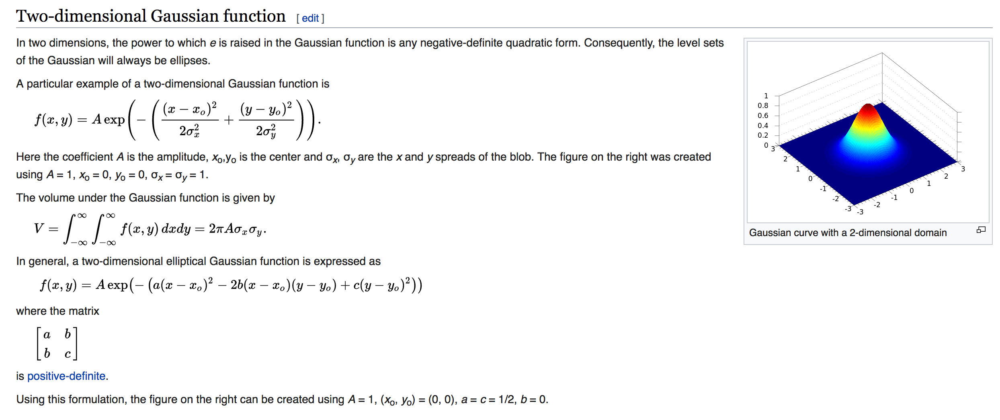
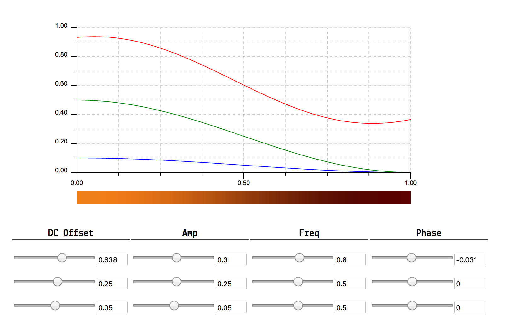
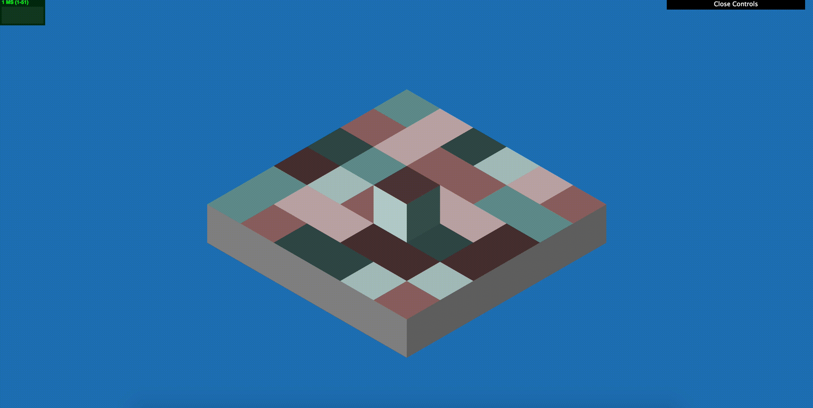
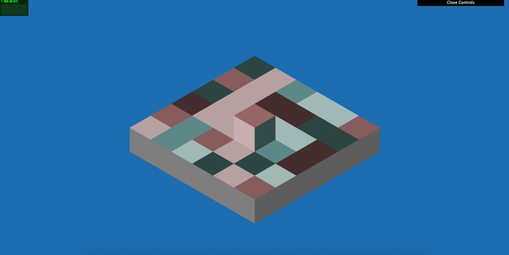
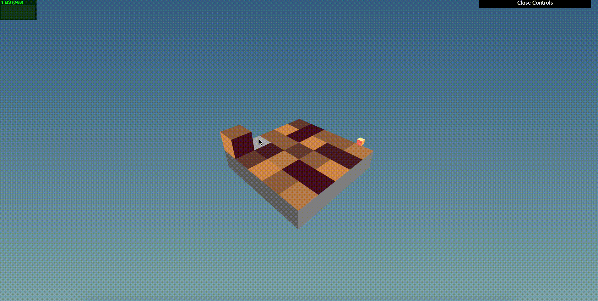
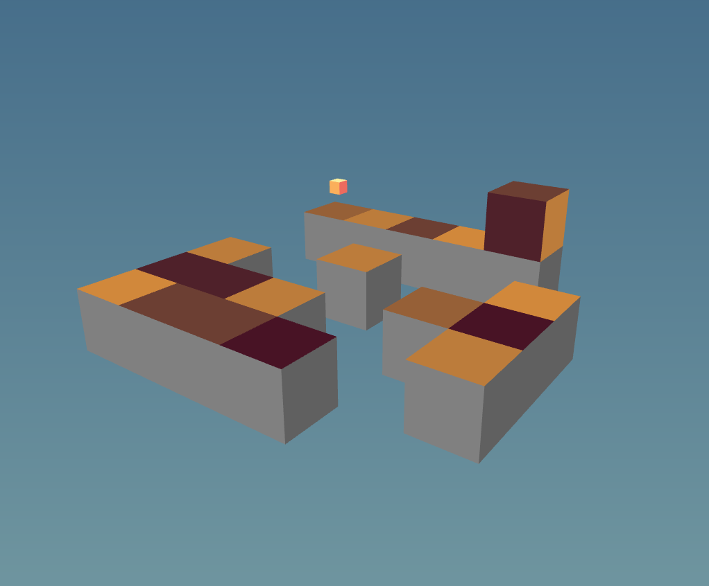
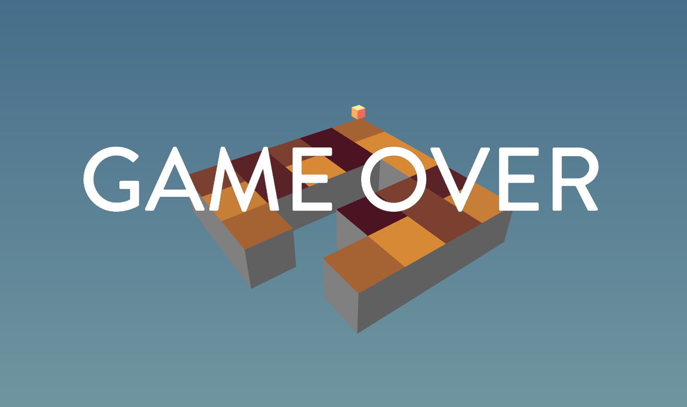
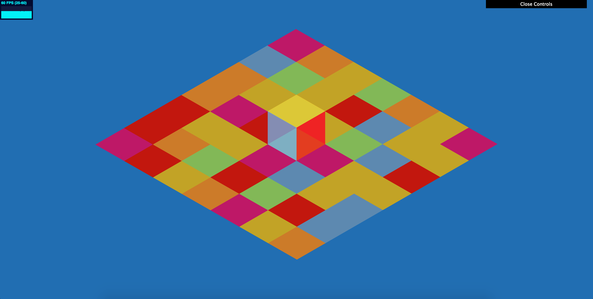
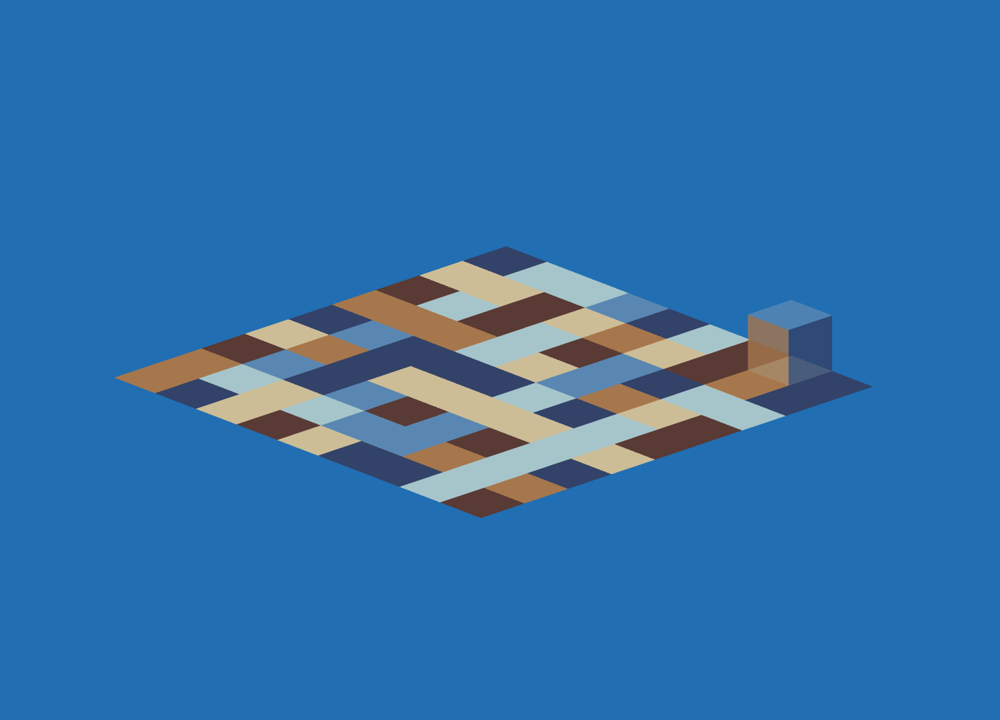

# Voxel Run: Procedural Graphics Final Project

## Design Document:

  - ### Introduction
    * Always wanted to make a technically challenging and aesthetically pleasing puzzle game. Had this game idea written down, and has been sitting there for a solid year or so. Want to actually make this game happen. 

  - ### Goal
    * Create a challenging, addictive, isometric puzzle game using simple geometry and gradient colors. 

  - ### Inspiration
    * Monument Valley 

    
    
    * Euclidean Lands 

    

    * Skyward 
    
    

  - ### Specification
    * This procedurally-generated puzzle game has a simple objective: flip a cube from grid cell to grid cell until you reach the finish cell. Each grid cell can be one of six colors corresponding to the six distinct face colors of the cube. What makes this game challenging is that the current cell the cube is on must have the same color as the bottom face of the cube. Once the cube lands on a grid cell, the cell color turns grey and the player cannot go back. There will only be one path to the finish, so the player must plan his or her moves accordingly.

  - ### Techniques
    * The main technical challenge is generating each level. I have to make sure that each level has only one solution, and the path from start to finish is not a simple and straightforward line. In order to check that each level has only one solution, the alternative and incorrect paths cannot cannot provide the cube a way to walk back on the correct path. In a sense, this is a graph theory problem, where each vertex is a grid cell, and each edge is a possible path from grid cell to grid cell. As long as there are no cycles, there can only be one solution. Generating a windy and complicated solution is another beast to handle. Currently considering a Perlin Worms algorithm to generate the solution to each level, but this is subject to change. As the levels progress, the grid size will become bigger, making the level much harder. However, my algorithm should be flexible enough to generate a reasonable path for each grid size.

  - ### Structure
    * Player Class: Class containing the state of the player, including the six faces and the direction the cube is facing.
    * Grid Class: Class containing the grid of grid cells, and a level generator to compute a reasonable puzzle for the player.
    * Main Class: Puts Cube and Grid class together, orchestrating the interaction between the two classes.

  - ### Timeline
    * April 18, 2017: Finish setting up the player and grid, be able to generate a path from start to finish, but do not have to fill in alternative paths yet.
    * April 25, 2017: Finish level generator with only a single solution to each level. Alternative, incorrect paths should be misleading to make the game difficult.
    * May 3, 2017: Polishing up the project. Fixing bugs, adding sound effects and animation, adjusting color pallette and aesthetics.

## Milestones:

  - ### Milestone 1
    * Finished setting up the player and grid class, where the player is able to rotate the cube using the arrow keys. For the player class, ran into the same problem with the turtle class in L-Systems project, where rotating the turtle using rotation.x, rotation.y, rotation.z has some issues. Still have to fix this by using quaternions instead. For the grid class, used Depth First Search to generate the whole level, instead of generating one single path. This part is currently operating, but will add more complexity to the Depth First Search level generation to make it more interesting.

  - ### Milestone 2
    * Fixed cube rotation by using quaternions instead of mesh.rotation. Found out that it is because there is a local rotation and world rotation for each THREE.Mesh that can be easily mixed up. Better to just use matricies in a scene graph style. Adjusted camera placement so that it is centered at the grid center, no matter what the dimensions of the grid is. Made multiple checks so that the cube can only flip if the color of the cube face that is going to face down matches the grid cell color. Added levels, where after crossing the finish cell, a new level appears with an increase in grid dimension. Realized that the plain Depth First Search level generation is too simple because on the edge of the grid, there is a 50 percent chance that it remains on the edge of the grid. Often the level generated has a easy path to the finish along the edge. Added a Gaussian Distribution Function to weigh the grid cells closer to the center more, so that the Depth First Search generator tends to go toward the center, making the level more complicated.

  - ### Milestone 3
    * Added a finish cell cube, or else a new player of the game doesn't know where the finish line is. Realized that the Depth First Search and Gaussian Distribution function level generator still does not work quite as expected. Now the level generator tends to go in a snake path, toward the center of the grid, then toward the edge, then toward the center again. Added a "throughput" that starts off as 1.0 and slowly decreases to 0.0 the more often the generator walks straight. This makes the paths generated more twisty and complicated. Added animation so that, to the player, it makes sense how the cube is flipping. Used a gain function to make the animation more realistic and lively. Added sound effects so that when the cube impacts on the ground, there is a "thump," and also added dream-like background music. Used raymarching so that the user no longer has to use arrow keys to move the cube. Instead, the user can use his or her mouse to select the grid cell to move to. Used cosine waves to procedurally generate the color for each level.

  - ### Final Tweaks
    * Changed the color of the raymarching grid cell selection depending if it is a movable grid cell or not. Realized that the game is too easy because the player can always move back if he makes a mistake, and there is no game over case. Made it so that once the user steps off a grid cell, the grid cell falls into an abyss. No more take-back-sies. If the user is stuck, he or she must take his or her own life by jumping into the abyss. Then it is game over. Added a start menu and game over screen so that there actually is a clear/definite start and end to the game. Made it so that not only does the grid dimension increase as the levels get harder, but also adjusted the throughput value so that the level generated paths are more twisty as the levels get harder. Changed the camera from orthographic to perspective in order to give depth to the grid cells falling.

## Final Report

  - ### Introduction
    * I always wanted to make a technically challenging, yet aesthetically pleasing puzzle game. I had this particular game idea written down, and it had been sitting on my desk for a solid year or so. Took this procedural final project as an opportunity to make this game actually happen and come to life.

  - ### Goal
    * Create a challenging, addictive, isometric puzzle game using simple geometry and gradient colors. 

  - ### Inspiration
    * Monument Valley 

    
    
    * Euclidean Lands 

    

    * Skyward
    
    

  - ### Specification
    * This procedurally-generated puzzle game has a simple objective: flip a cube from grid cell to grid cell until you reach the finish cell. Each grid cell can be one of six colors corresponding to the six distinct face colors of the cube. What makes this game challenging is that the current grid cell the cube is on must have the same color as the bottom face of the cube. Once the cube lands on a grid cell, the previous grid cell falls into an abyss and the player cannot go back. The player must plan his or her moves accordingly. In essence, this game is a maze without walls. 

  - ### Techniques
    * Level Generation: 
      * Started off with a Depth First Search level generation algorithm where a simulated cube walks on a random path until all its neighboring grid cells are visited. Then the cube takes a step back, and checks if there are any neighboring grid cells that are not visited. If so, the cube walks on a random path again. This repeats until the simulated cube reaches its starting position. An emergent behavior that came out of this algorithm was that very frequently, a generated path would continue along the edge of the grid. This is because on an edge of a grid, there are only two possible directions the simulated cube can move: along the edge again, or toward the center of the grid. Since I weighed both choices equally, a grid-edge path was very common. In order to fix this, I tried using a Gaussian Distribution Function to weigh the choices of the simulated cube unequally; the grid cells near the center of the grid will have higher probability of being chosen. I picked the variance based on the empirical rule of the normal distribution, where the grid dimensions span from (mean-2sigma) to (mean+2sigma).

      

      

      * I ran into another problem with this modification of the Depth First Search level generation algorithm. Because I picked such a large variance, the probability of the center grid cells is significantly higher than the edge grid cells. This ended up causing my simulated cube to walk straight toward the center of the grid, then around the center of the grid until there are no more unvisited grid cells, then along the grid edges. Again, grid-edge paths became very common. I decided to pick a smaller variance and this fixed the problem. 

      * The next emergent behavior I noticed was that the paths generated were too straight. I applied what I learned in Advanced Computer Graphics of a throughput variable that starts off at 1.0 and decreases over time to 0.0. Now, every time the simulated cube walks in the same direction as the previous step, the throughput variable is decreased by a factor of 0.5 and then multipled to the probability of the upcoming same-direction grid cell choice. In other words, the more consecutive straightforward steps the simulated cube takes, the least likely the next straightforward step will be. I later realized that depending on the throughput factor, the paths can be more or less twisty. I decided to have a smaller throughput factor at the start of the game and slowly increase it in each proceeding level.

      * My original worry of making sure the player cannot cross though "walls" between generated paths quickly disappeared after I realized that even though the player can cross through "walls," it is very unlikely for the player to continue along the crossed path because the cube must be in a certain orientation/rotation. What I mean by this is that the bottom face of the cube may match with the grid cell after crossing through a "wall," but there are 4 possible ways the cube can be orientated, and only one orientation can allow the player to continue to move along the crossed path. And even if the player can move along the crossed path, the crossed path does not necessairly lead to the finish cell. As a result, I chose to ignore this case because it actually benefits my game by adding an extra layer of complexity: 3 out of the 4 times the player is able to cross through a "wall" will lead to a dead end due to the incorrect orientation of the cube.

    * Color: 
      * Originally, I was hand-picking color gradients using IQ's idea of a color palette based on three cosine functions corresponding to R, G, and B. However, this limited the possibilities of color to a finite, hand-picked amount. I thought to myself, since R, G, and B are represented as cosine functions anyway, why not generate the color procedurally? I first decided what general color the procedurally generated gradients should be. Basing my decision on the computer graphics concept of a yellow key light (from sun), and a blue fill light (from sky), I wanted the grid colors to have a general red to yellow gradient since the background was nice shade of blue already. Playing around with the equations, I noticed that the R and G cosine functions should be similar, but not equivalent in phase to produce a yellow shade. The R and G cosine functions should have high amplitude so that there is a visible change in color gradient, or else the 6 face colors of the cube will be too similar in hue. The B cosine function should generally be close to 0.1 because when B is too high, it causes the red to turn purple and yellow to turn brown, and when B is 0, the shades of red and yellow do not seem realistic enough (there is no such thing as perfectly red/green with no blue in real life). I also made sure that the R, G, and B functions do not get exceed the 0 to 1 range given the y-displacement and amplitude because this will cause some section of the color gradient to receive a consistent contribution of R, G, or B, making the gradient sections less distinctive for the 6 face colors. Here is a visualization of how my procedural color gradient generator looks like:

      

    * Animation: 
      * In order for the cube rotations to make sense in the eyes of the viewer, there should be animation. The cube shouldn't "jump" from grid cell to grid cell. Rather, there should be some smooth transition. I originally thought of LERPing the start and final positions of the cube flip, and SLURPing the start and final quaternion rotations of the cube flip. To my surprise, the cube center does not remain at the same height when flipped, thus LERPing the start and final positions (which are at the same y height) would not work. 

      

      * SLURPing the start and final quaternions does work for rotation, but SLURPING at an axis of rotation that is not the cube center (but a cube edge) requires extra translation transformation. I decided to manually use a T*R*T matrix transformation every time onUpdate is called, where the R matrix is a SLURP of the two quaternions. After getting the animation to work, I felt as though something was missing. The cube did not have character. I decided to add a Toolbox Function I learned, the gain function, to distort the speed at which the cube rotates given a certain t value between 0 and 1. The first GIF is an animation of a cube WITHOUT the gain function applied, and the second GIF is an animation of a cube WITH the gain function.

      

      

    * Raymarching: 
      * Originally I thought fixing the camera rotation to a specific angle and allowing the user to view the back faces of the cube by hovering over the cube with a mouse was a good idea. That way, the arrow keys can stay in the same orientation. My good ol' pal Adam suggested to use ray marching to select a grid cell to move the cube instead. Then the user can rotate the grid to his or her discretion, while viewing all sides of the cube. That was a great idea. Thanks Adam! In the onUpdate function, I raymarch a ray originating at the mouse with a direction of the camera forward vector to find the closest intersected object. If the intersected object is a grid cell, then I highlight the top face light gray or dark gray, depending on if it is a valid move or not.

      

  - ### Structure
    * Player Class: Class containing the state of the player, including the six faces and the direction the cube is facing.
    * Grid Class: Class containing the grid of grid cells, and a level generator to compute a reasonable puzzle for the player.
    * Main Class: Puts Cube and Grid class together, orchestrating the interaction between the two classes. Also handles the logic for the game.

  - ### Timeline
    * April 18, 2017: Finish setting up the player and grid, be able to generate a path from start to finish, but do not have to fill in alternative paths yet.
    * April 25, 2017: Finish level generator with only a single solution to each level. Alternative, incorrect paths should be misleading to make the game difficult.
    * May 3, 2017: Polishing up the project. Fixing bugs, adding sound effects and animation, adjusting color pallette and aesthetics.

  - ### Results:

    

    

    

  - ### Evaluation:
    * Overall, I feel like I have come a long way. I started this project thinking it will be almost impossible to generate the types of levels I imagined, but I took clever approaches and applied a lot of what I learned to solve difficult situations, such as keeping track of which face color is facing which direction in the world without the need of a rotation matrix but only 6 variables, fixing the unwanted emergent behavior of the Depth First Search level generator, and applying color and toolbox functions to make the game more aesthetically pleasing. 

    There were many tweaks that had to be made throughout the process. I changed the camera from orthographic to perspective in order to give depth to the grid cells falling, added a finish cell cube, or else a new player of the game doesn't know where the finish line is, used raymarching so that the user no longer has to use arrow keys to move the cube, used cosine waves to procedurally generate the color for each level, and changed the color of the raymarching grid cell selection depending if it is a movable grid cell or not. I also realized that the game is too easy because the player can always move back if he makes a mistake, and there is no game over case. I then made it so that once the user steps off a grid cell, the grid cell falls into an abyss. No more take-back-sies. If the user is stuck, he or she must take his or her own life by jumping into the abyss. Then it is game over. I also added a start menu and game over screen so that there actually is a clear/definite start and end to the game. Lastly, I modified the game design so that not only does the grid dimension increase as the levels get harder, but throughput factor decreases so that the level generated paths are more twisty as the levels get harder. 

    

    

  - ### Future work:
    * Given more time, I would add more complexity to the game, such as not only making the level a 2D grid. Instead, the cube can walk on walls and ceilings, as long as the cube face colors are matching both surfaces at the corner of the wall. In addition, I would want to add a way for users to keep track of their thought process, such as being able to add "flags" on the grid surface, similar to Mineweeper. This would keep the interest of the players rather than having them give up when the grid dimension becomes too big.

  - ### Acknowledgements:
    * Special thanks to Rachel Hwang, Adam Mally, Sally Kong, Trung Le, and Austin Eng for being so supportive throughout the semester, and especially throughout this project!

    * Gaussian Distribution
      * https://en.wikipedia.org/wiki/Gaussian_function#Two-dimensional_Gaussian_function
      * https://en.wikipedia.org/wiki/Normal_distribution#/media/File:Empirical_Rule.PNG

    * Colors
      * http://www.iquilezles.org/www/articles/palettes/palettes.htm
      * http://dev.thi.ng/gradients/

    * Raymarching
      * https://stemkoski.github.io/Three.js/Mouse-Over.html
      * https://github.com/mrdoob/three.js/issues/5587
      * http://stackoverflow.com/questions/20361776/orthographic-camera-and-pickingray

    * Mouse Detection
      * https://threejs.org/examples/?q=out#webgl_postprocessing_outline

    * Camera Orbit Controls
      * https://searchcode.com/codesearch/view/58375664/

