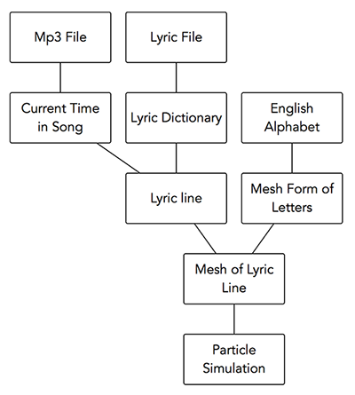
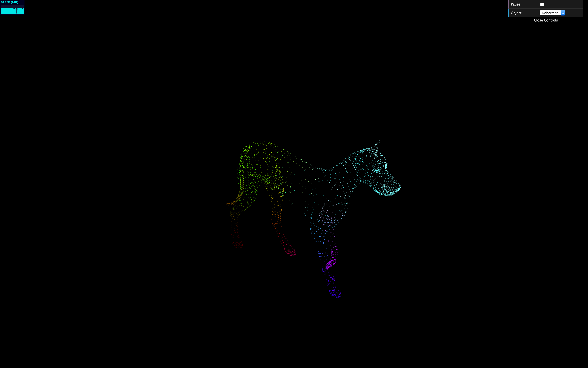

# Particle Lyric

Demo: https://msoudy.github.io/Final-Project/

Lyric Files: https://syair.info/

Introduction
----

I find it satisfying to watch thousands of particles floating in space and morphing into different shapes. You can almost make a visual representation of anything with a particle system, and watching several examples of particle simulations, like “A Particle Dream” has inspired me to work on a particle simulation.

Goal
-----

Given a LRC file (lyric file) and an MP3 file create a lyric video using particles which can be altered through various GUI parameters, such as mouse position attract/repel forces, and modification of particle attributes, such as color, speed, size and mass.

Inspiration/reference:
------

WebGL2 Particles using Transform Feedback - https://pwambach.github.io/webgl2-particles/
A Particle Dream - v1.0 — https://youtu.be/YB2u2WhZjxU
WebGL FBO Particle System — https://youtu.be/HtF2qWKM_go
GPU Accelerated Particles (Javascript, WebGL) — https://youtu.be/lJe5zEr4b0Q

Specification
--------------

- Particle system on the GPU allowing the simulation of thousands of particles where each particle has the following attributes
    - Position
    - Velocity
    - Acceleration
    - Mass
    - Target Position (usually position of mesh vertex)
    
- Mesh form of the English alphabet including special characters
Each letter is mapped on to a 5x5 2D array of 0 and 1s, where for each cell assigned with 1 a sphere mesh is created. The following diagram illustrates how the letter ‘A’  is mapped to a 2D array.

  
  
- Lyric file (LRC) parser and mp3 loader
    - Parse each line in the lyric file and store the time stamp and corresponding lyric line into a dictionary to be accessible later
- Synchronize played song with lyrics simulated on screen
    - Given the current time in the song, the lyric that should be simulated using particles is first fetched from the dictionary generated by the lyric parser and each letter in the lyric is converted into meshes where each particle is assigned to a specific vertex in the mesh

Techniques
-----------

The particle simulation is created on the GPU using a process called transform feedback which allows capturing data from the vertex shader and storing it in buffers to be used again in the next iteration. This is required to keep track of the previous attributes of particles such as position, velocity, acceleration and mass.

Detailed explanation: 

Two shader programs (particles program & draw program) are created; one to perform any calculations for the position, velocity, acceleration and mass of the particles and the other to draw the particles. Before the draw call for the particles program, the rasterizer is disabled since no drawing is required and transform feedback is initiated. After the draw call, transform feedback returns the results from the particles program vertex shader (outPos, outVel, outAcc, outMass) which are stored in buffers. The rasterizer is then re-enabled and the draw program is used to draw the points. Finally, the attribute buffers of the particles shader are swapped with the buffers from transform feedback to be used as input in the next iteration.

The following references were used to help implement transform feedback:

- Transform feedback in OpenGL: https://open.gl/feedback
- Transform Feedback simple example: https://www.ibiblio.org/e-notes/webgl/gpu/bounce.htm
- Transform Feedback with particles: https://www.ibiblio.org/e-notes/webgl/gpu/lorenz_ft.htm
- Transform Feedback firework example: https://github.com/WebGLSamples/WebGL2Samples/blob/master/samples/transform_feedback_separated_2.html

Design
----

Inspiration/References:
----------------------
- A Particle Dream - v1.0 — https://youtu.be/YB2u2WhZjxU
- WebGL FBO Particle System — https://youtu.be/HtF2qWKM_go
- GPU Accelerated Particles (Javascript, WebGL) — https://youtu.be/lJe5zEr4b0Q

Timeline:
----

- Week 1 - Create Particle Simulation on the GPU
- Week 2 - Move particles to target mesh positions  to from mesh shape
- Week 3 - Synchronize song lyrics using particles given an input lyric & music file

Results:
----

Evaluation:
-----

Originally I intended to create a music video with particles by simulating 3d objects which relate to a specific song. However, altering the purpose of my project to be more of a tool for users to use in the future was a better approach. Simulating lyrics synchronized with a song is not only satisfying to watch but can also be useful. Users can use this tool to create lyric videos of their songs to upload on youtube in minutes by screen recording the particle simulation. They can modify the look and feel of the particles by changing the mesh shape of the letters (cube, sphere, torus) and the various parameters of the particles.

The following image represents the particle simulation I had before. I simulated a walking Doberman. Although, this is appealing, the novelty of the experience wears off and the things you can add to extend the particle simulation is limited compared to simulating music lyrics with particles. Not only do hundreds of new songs come out every day, the amount of features that can be added to help customize the lyrics and the surrounding scene are endless.

Changing the project has opened many doors for me. Putting aside all the alterations that can be added to the lyrics themselves, I can include different backgrounds simulated with particles or include a list of general obj’s which can be added by the user at specific times in the song. The list can also be generated based on the word list of the song lyrics.

Overall, I felt constricted with what I can do by just creating a single enjoyable experience for a specific song. I preferred to create a project that users can come back to; a project I can expand in many different ways and one that would prove to be useful to many people in the future. In the simplest scenario, it can be used during karaoke sessions.

Future Work:
----

Improvements:

- Rewrite algorithm which aligns the lyric to the center to accomodate for any number of words by automatically resizing font size, and possibly allowing user to change alignment attributes, such as alignment type, line spacing, line max width & height
- Reduce the number of if statements in shader file to improve performance
- Create GUI from scratch to give it a unique look, instead of using dat.GUI library

Additional features:

- Playback controls to uploaded song, including fast-forward and rewind
- Integration of Spotify player, so that user doesn't need to upload songs
- Script to automatically fetch lyric file from websites that supply lyric files. This would work well with Spotify as song name and artist can be extracted from Spotify
- Vibrate particles with the beat of the song
- Allow users to change font and font attributes
- Allow simulation recording and download of lyric video
- Add different backgrounds to choose from (could also be simulated with particles) 
- Provide users with a list of obj’s to add at specfic times in the song
- Automatically show a list of relevant obj’s based on the word list of the song lyrics
- Support for different languages

Acknowledgments:
-----

- WebGL fundamentals: https://webgl2fundamentals.org/webgl/lessons/webgl-fundamentals.html

- WebGL resizing canvas: https://webgl2fundamentals.org/webgl/lessons/webgl-resizing-the-canvas.html

- Transform Feedback simple example: https://www.ibiblio.org/e-notes/webgl/gpu/bounce.htm

- Transform Feedback with particles: https://www.ibiblio.org/e-notes/webgl/gpu/lorenz_ft.htm

- WebGL necessary helper functions: https://webgl2fundamentals.org/webgl/lessons/webgl-boilerplate.html

- Transform feedback in OpenGL: https://open.gl/feedback

- Transform Feedback firework example: https://github.com/WebGLSamples/WebGL2Samples/blob/master/samples/transform_feedback_separated_2.html

- Particle Simulation WebGL 2: https://github.com/pwambach/webgl2-particles

- Agent behaviors: http://natureofcode.com/book/chapter-6-autonomous-agents/