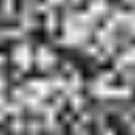
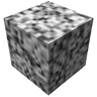
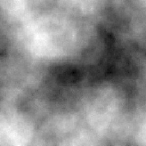
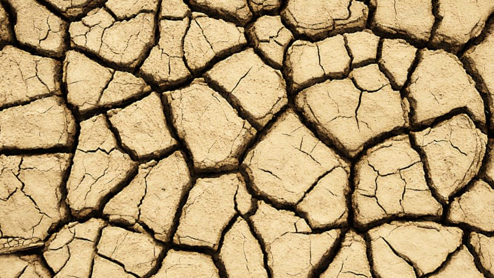

### CIS700 Procedural Graphics: Final Project
# Procedural Terrain using Cesium
#### By: Rudraksha Shah and Rishabh Shah
-----

### Introduction
This project consists of procedural generation of terrain and textures for Cesium. Cesium fetches tiles with geometry data from a server. We will be adding proceduralism to Cesium by providing the procedural terrain in place of pre-modelled structures.

### Goal
The geometry data Cesium fetches from the servers is based on the camera position. When the camera moves to an object, a higher resolution mesh is rendered. Our goal is to develop an algorithm that can generate terrain and textures in such incremental levels of detail. We will be creating a web server to provide the generated content.

### Inspiration/ Reference
Some cool demos that inspired us to do this project:
- Ixaleno: A 4kb executable by IQ: tps://www.youtube.com/watch?v=XAWPCmVC5jA
- fp.skiView: IQ again: https://www.shadertoy.com/view/XdjXDK
- Planet Shadertoy: by reinder: https://www.shadertoy.com/view/4tjGRh

### Specification
Our final product would feature:
- Procedurally generated terrain.
- Procedurally generated texture for the terrain.
- Varying levels of detail for the terrain and the textures based on the distance of the camera from the terrain.
- Web server serving the content to Cesium.

### Techniques

#### Terrain Generation
1. For the procedural terrain generation part we are planning to make a 3D height field using pseudorandom perlin noise that will be divided into a set of tiles to discretise the terrain creation.

2. Another method for obtaining the initial seed values for the terrain can be generated using various fractal patterns as mentioned below.

3. Using the seed random data converted to a 2D array, we will apply the Diamond-Square algorithm to procedurally generate and tessellate the terrain with realistic looking mountain, valleys and rough terrain.

4. Another approach that can be used to generate the terrain would be as mentioned in this article [[1]](http://www-cs-students.stanford.edu/~amitp/game-programming/polygon-map-generation/) using voronoi patterns. We don’t exactly know how cesium tiling works and how we can use this methods to procedurally generate more definition in the terrain as the level of detail increases. We will get a better idea on which methods are feasible to use once we get an understanding on how cesium works.

#### Texture Generation
We will be working on multiple texture generation algorithms to achieve different terrain effects.

1. Fractals: This can be used if the finer details are to be added to coarser images, as fractals are repetitive. Also, we can get other cool terrain features like rivers using fractals.

2. Voronoi patterns / Cell noise / Worley noise: To achieve a dry land kind of effect, one of these methods will be used. These can also be used for texturing stones.

3. Ridged fractal/perlin noise: This will be used for creating smoother looking textures like desert or snow, and for blending the textures. This is very similar to the original Perlin noise algorithm, with some modifications [[2]](http://www.inear.se/2010/04/ridged-perlin-noise). We will be using either one of those. Examples of ridged fractal noise textures:

4. Blending different textures for smoother transition. Dirt and snow on mountains, sand and water on beaches, etc. don’t have hard edges. We don’t have a proper idea of what the best method would be to achieve this. There are some articles describing the use of height maps to do this [[3]](http://www.cprogramming.com/discussionarticles/texture_generation.html). We will get a better idea about this as we begin working on the generation algorithms.

5. Since we are aiming for realistic images, we would like to explore Whittaker diagram for biomes of multiple terrain types [[4]](https://w3.marietta.edu/~biol/biomes/biome_main.htm), if time permits. It uses data like temperature and humidity to define biomes.

### Design
As stated before, Cesium obtains tiles from the server. We will be creating a web server that provides the 3D tile content.

### Timeline
- 09 April - 15 April
    - Rishabh & Rudraksha: Getting the server part working.
    - Rishabh: Start with ridged fractal/perlin noise.
    - Rudraksha: Understand the tiling method used by cesium to start working on the terrain generation.
- 16 April - 22 April
    - Rishabh: Complete ridged fractal/perlin noise and start with Voronoi / fractals depending on the terrain types that are going to be generated.
    - Rudraksha: Generate the terrain height field data and pack it in the .gltf format for output to cesium.
- 23 April - 29 April
    - Rishabh: Complete all the texture generation part. Work on the blending of textures if not already taken care of while implementing the generation.
    - Rudraksha: Finish any remaining details and merge the code.
- 30 April - 03 May
    - Time buffer.
