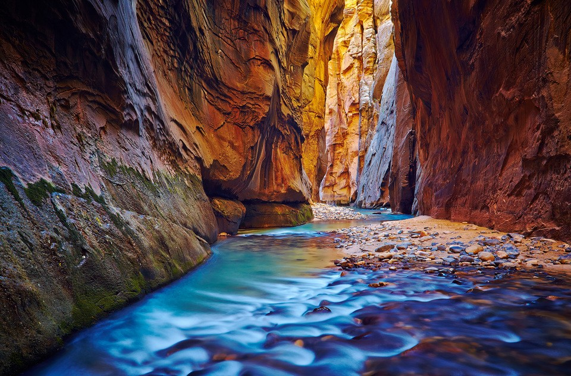
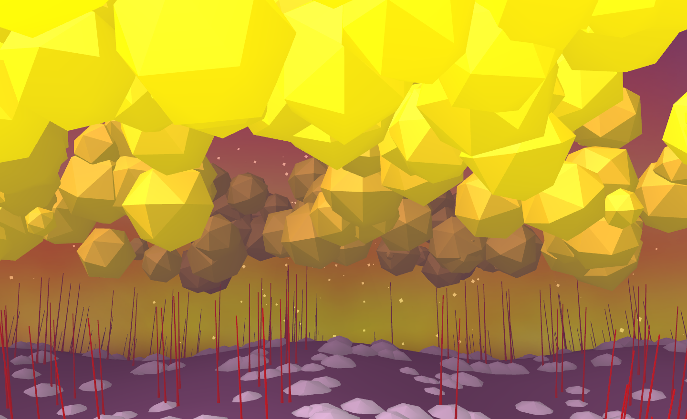
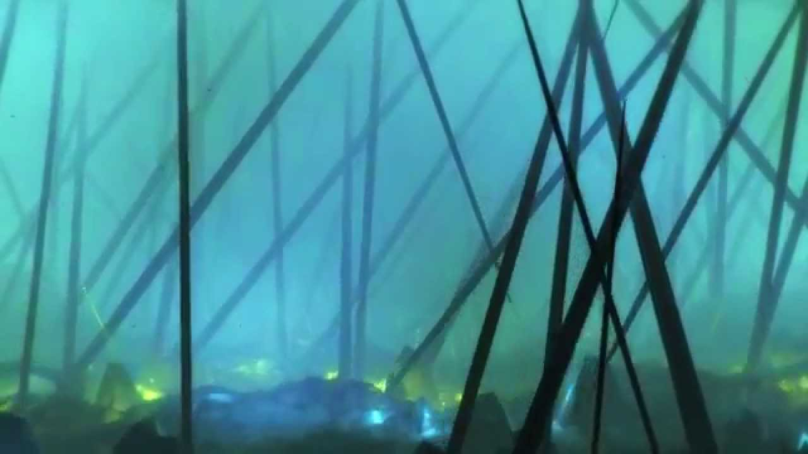
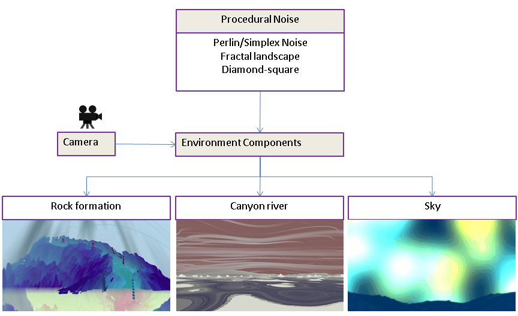
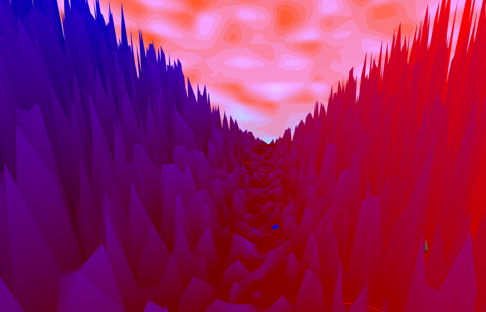
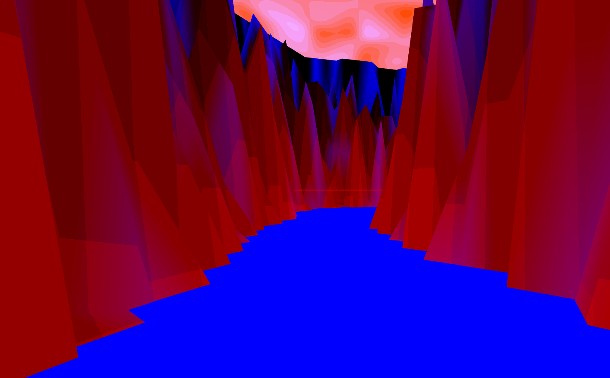

# Zionical

This project is inspired by [Panoramical][1], a game where players can manipulate landscapes musically. In this game, the environments are highly abstracted and colorful 

## Goal

I would like to create an environment inspired by Zion National Park. The environment will be interactive with mouse and camera control. In addition, parts of the environment will move or pulse at the frequency of a chosen song. The entire program will be written in Javascript using the THREE.js library. 

## References

### Zion

- #### Zion Canyon

### Art Abstraction
 

## Specification

### Color
In keeping with the abstract theme, the colors will be bright and closer to toon shading than gradients. There will be no actual lights in the scene, but objects will be visualized with abstract shaders instead. To give the scene more depth, I would like to add an ambient occlusion shader as well.  
### Camera
The camera will appear to move through the base of canyon (either the camera or the geometry will move). In addition, the actual viewing direction will be interactive. 
### Objects
Instead of creating a large environment and slowing down the FPS, the geometry will be stored in a buffer geometry with new vertices replacing the old behind the camera. 
### Music
The frequency and amplitude of the background music will influence the frequency and amplitude of the textural noise. 
 Infinite camera moving. Abstract geometry, no lighting

## Techniques

The majority of the procedural techniques I will use are noise generation algorithms for creating rocky terrain. We have thus far explored the use of perlin noise, but for this environment I want to expand to different types of noise. As seen in the image above, Zion canyon is rocky and eroded. I believe the following papers and algorithms will be helpful in achieving this effect.   

* [Realtime Procedural Terrain Generation][2] 
* Perlin Noise and [Simplex][3] Noise 
* [Diamond-square algorithm][4]
* [Fractal landscape][5]

I will try the various techniques and choose the one or ones that look the best artisticly. 

## Design

## Timeline

### Week of 04/10
* Create rough rock formation 
* Choose a song and animate some aspect of environment
* Move camera through the environment

### Week of 04/17
* Create the canyon dugout

### Week of 04/24
* Polish with shaders

[1]: https://vimeo.com/88946422
[2]: http://web.mit.edu/cesium/Public/terrain.pdf
[3]: http://webstaff.itn.liu.se/~stegu/simplexnoise/simplexnoise.pdf
[4]: http://stevelosh.com/blog/2016/06/diamond-square
[5]: http://paulbourke.net/fractals/noise/