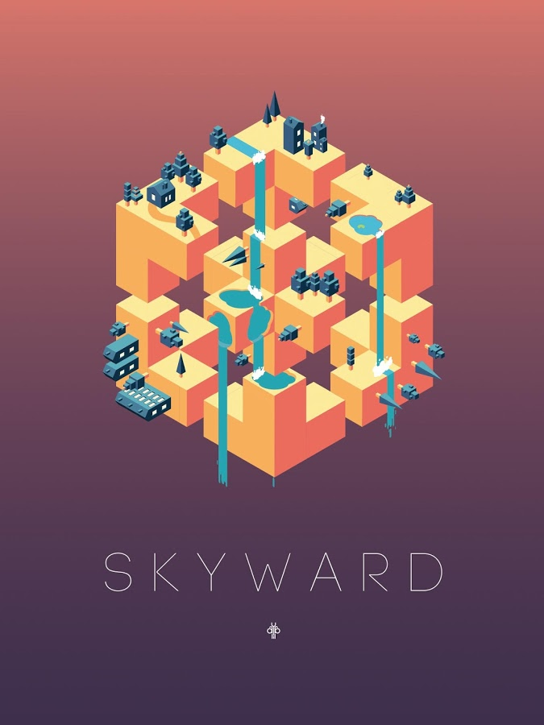

# CIS700 Procedural Graphics: Final Project

Time to show off your new bag of procedural tricks by creating one polished final project. For this assignment you will have four weeks to create and document a portfolio piece that demonstrates your mastery of procedural thinking and implementation. You may work in groups of up to three (working alone is fine too). You may use any language / platform you choose for this assignment (given our approval if it’s not JavaScript/WebGL or C++/OpenGL).

As usual with this class, we want to encourage you to take this opportunity to explore and experiment. To get you started, however, we’ve provided a few open-ended prompts below. Interesting and complex visuals are the goal in all of these prompts, but they encourage focus on different aspects of proceduralism.

## Prompt Chosen:

- ### A game level
  * Like generations of game makers before us, create a game which generates an  navigable environment (eg. a roguelike dungeon, platforms) and some sort of goal or conflict (eg. enemy agents to avoid or items to collect). Must run in real-time. Aim to create an experience that will challenge players and vary noticeably in different playthroughs, whether that means complex dungeon generation, careful resource management or a sophisticated AI model. Focus on designing a system that will generate complex challenges and goals.
  * Examples: Spore, Dwarf Fortress, Minecraft, Rogue

## Timeline

- 4/08	Design doc due / Have met with procedural staff
- 4/18	Milestone 1 (short write-up + demo)
- 4/25	Milestone 2 (short write-up + demo)
- 5/3	Final presentations (3-5 pm, Siglab), final reports due

### Design Document:

- ### Introduction
  * Always wanted to make a technically challenging and aesthetically pleasing puzzle game. Had this game idea written down, and has been sitting there for a solid year or so. Want to actually make this game happen. 

- ### Goal
  * Create a challenging, addictive, isometric puzzle game using simple geometry and gradient colors. 

- ### Inspiration
  * Monument Valley 

  
  
  * Euclidean Lands 

  

  * Dancing Line 
  
  

- ### Specification
  * This procedurally-generated puzzle game has a simple objective: flip a cube from grid cell to grid cell until you reach the finish cell. Each grid cell can be one of six colors corresponding to the six distinct face colors of the cube. What makes this game challenging is that the current cell the cube is on must have the same color as the bottom face of the cube. Once the cube lands on a grid cell, the cell color turns grey and the player cannot go back. There will only be one path to the finish, so the player must plan his or her moves accordingly.

- ### Techniques
  * The main technical challenge is generating each level. I have to make sure that each level has only one solution, and the path from start to finish is not a simple and straightforward line. In order to check that each level has only one solution, the alternative and incorrect paths cannot cannot provide the cube a way to walk back on the correct path. In a sense, this is a graph theory problem, where each vertex is a grid cell, and each edge is a possible path from grid cell to grid cell. As long as there are no cycles, there can only be one solution. Generating a windy and complicated solution is another beast to handle. Currently considering a Perlin Worms algorithm to generate the solution to each level, but this is subject to change. As the levels progress, the grid size will become bigger, making the level much harder. However, my algorithm should be flexible enough to generate a reasonable path for each grid size.

- ### Design
  * Player Class: Class containing the state of the player, including the six faces and the direction the cube is facing.
  * Grid Class: Class containing the grid of grid cells, and a level generator to compute a reasonable puzzle for the player.
  * Main Class: Puts Cube and Grid class together, orchestrating the interaction between the two classes.

- ### Timeline
  * April 18, 2017: Finish setting up the player and grid, be able to generate a path from start to finish, but do not have to fill in alternative paths yet.
  * April 25, 2017: Finish level generator with only a single solution to each level. Alternative, incorrect paths should be misleading to make the game difficult.
  * May 3, 2017: Polishing up the project. Fixing bugs, adding sound effects and animation, adjusting color pallette and aesthetics.

## Milestones

  - ### Milestone 1
    * Finished setting up the player and grid class, where the player is able to rotate the cube using the arrow keys. For the player class, ran into the same problem with the turtle class in L-Systems project, where rotating the turtle using rotation.x, rotation.y, rotation.z has some issues. Still have to fix this by using quaternions instead. For the grid class, used Depth First Search to generate the whole level, instead of generating one single path. This part is currently operating, but will add more complexity to the Depth First Search level generation to make it more interesting.

## Final Report

In addition to your demo, you will create a final report documenting your project overall. This document should be clear enough to explain the value and details of your project to a random computer graphics person with no knowledge of this class.

### Final Report Template:

- #### Updated design doc: 
  * All the sections of your original design doc, corrected if necessary
- #### Results:
  * Provide images of your finished project
- #### Evaluation (this is a big one!):
  * How well did you do? What parameters did you tune along the way? Include some WIP shots that compare intermediate results to your final. Explain why you made the decisions you did.
- #### Future work:
  * Given more time, what would you add/improve
- #### Acknowledgements:
  * Cite _EVERYTHING_. Implemented a paper? Used some royalty-free music? Talked to classmates / a professor in a way that influenced your project? Attribute everything!

## Logistics

Like every prior project, your code will be submitted via github. Fork the empty final project repo and start your code base from there. Take this as an opportunity to practice using git properly in a team setting if you’re a new user.  For each weekly submission, provide a link to your pull request. Your repo will contain all the code and documentation associated with your project. The readme for your repo will eventually be your final report. At the top level, include a folder called “documentation”, where you’ll put your design doc and milestone write-ups.

Don’t wait to merge your code! Seriously, there be dragons. Try to have a working version including all your code so that compatibility and merge issues don’t sneak up on you near the end.

## Grading

- 15% Design Doc (graded as a group)
- 15% Milestone 1 (graded as a group)
- 15% Milestone 2 (graded as a group)
- 55% Final demo + report (graded individually)

NOTE: We’ve been pretty lax about our late policy throughout the semester, but our margins on the final project are tight, therefore late submissions will NOT be accepted. If you have a significant reason for being unable to complete your goals, talk to us, and we’ll discuss getting you an incomplete and figure out an adjusted work plan with your group.

