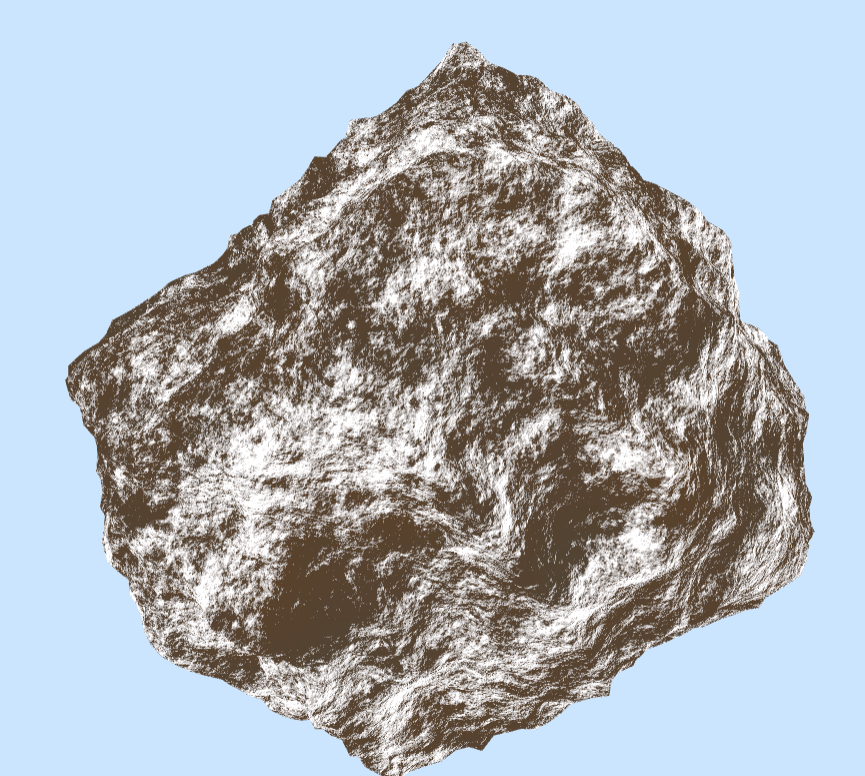

### Milestone-1 Report:

### Rishabh

- I tried setting up Cesium and the server we will be using to send the data to cesium. I spent an entire day trying to get cesium to work but it just won't. So I downloaded an older version, and it worked. But I still can't get the server to work. So for now, my code is in [this](https://github.com/rms13/Project1-Noise) repo. Rudraksha is looking into the server issue.

- `shaders/mountain-frag.glsl` fragment shader contains the shader that textures the mountain. Value Noise algorithm is used as the noise generator. It is a slightly modified version (the noise function and the matrices are different) of what IQ shows [here](http://www.iquilezles.org/www/articles/morenoise/morenoise.htm). The derivatives of noise are used to simulate erosion effects. It still needs some work.

- `shaders/mountain-vert.glsl` vertex shader uses Ridged Value Noise to model mountains. This is *not* the terrain we will be using for the final version. It's used only for testing the texture. The terrain part (using Diamond Square algorithm) is being done by [Rudraksha](https://github.com/rudraksha20).

- Demo: https://github.com/rms13/Project1-Noise

#### Example images:

Value noise:

Absolute value noise:

Ridged value noise:

2nd derivative of value noise:

Example texture:

Example texture with terrain:

### Rudraksha Shah

#### Procedural Terrain:

`Main.js:` contains the implementation of the Diamond Square algorithm that I have implemented to procedurally generate the terrain.

`TODO:` I am working on improving the terrain structure and removing the artifacts created by the random number and the diamond square algorithm.

`Diamond Square Algorithm:` consists of the following main steps

- Initial Grid:

- The Diamond Step

- The Square Step

### Tessellated Terrain Mesh Images:

### Tessellated Terrain WireFrame Images:

- Demo: Rudraksha20.github.io/Final-Project/
