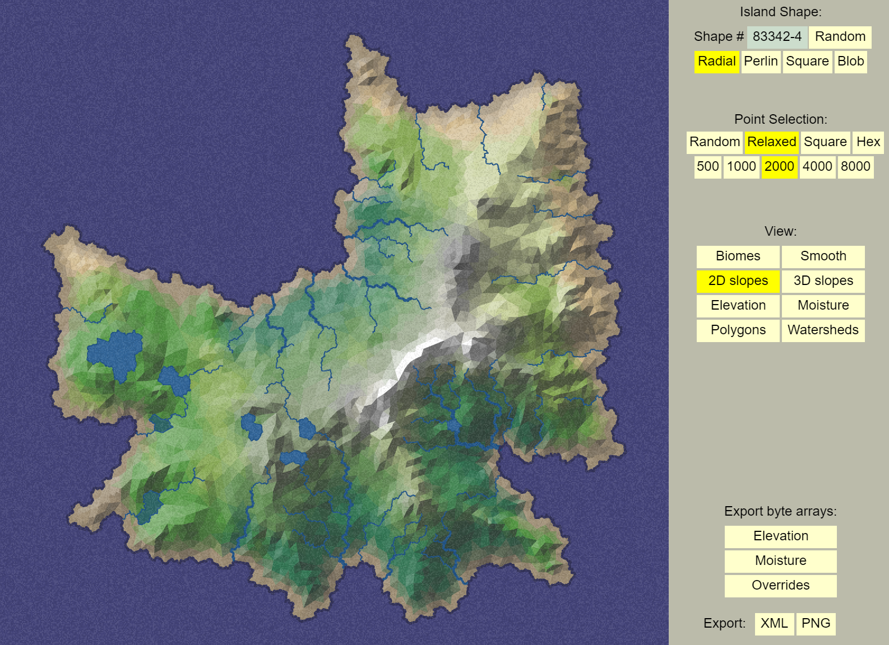
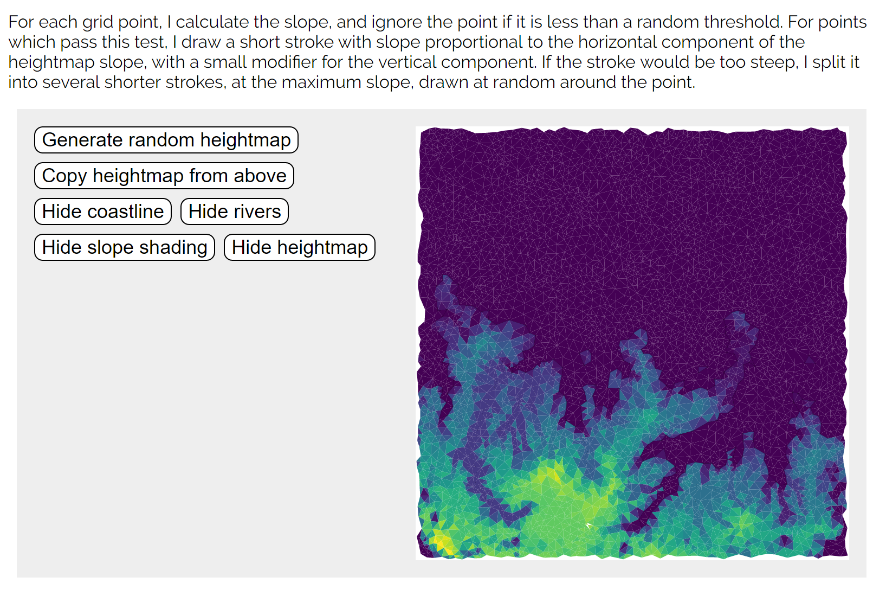
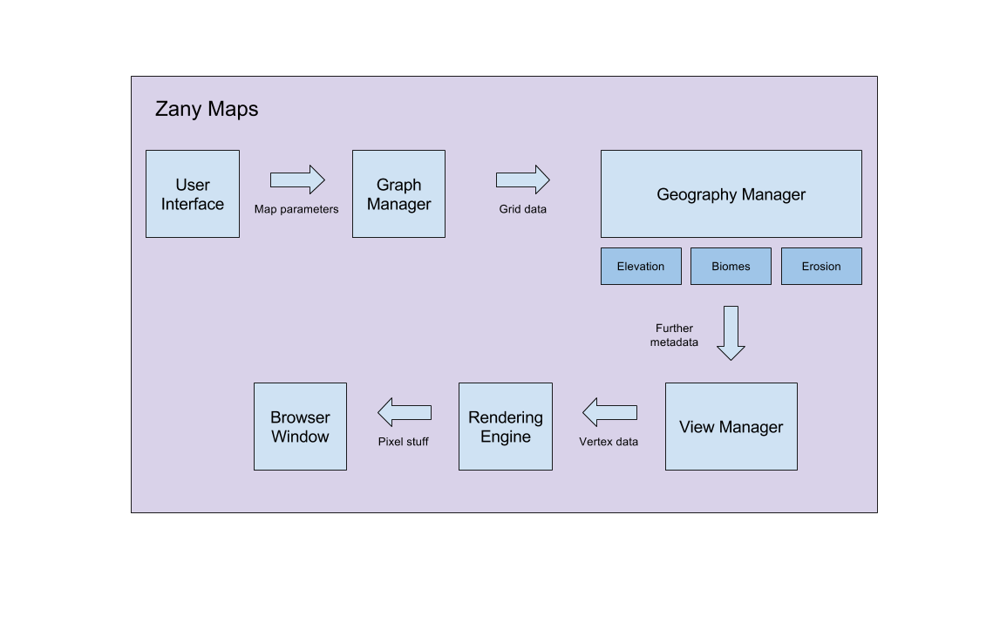

# Zany Maps: Procedurally Generated Maps

Zack Elliott

### Introduction:

I read a lot of fantasy books when I was younger (Redwall, The 13½ Lives of Captain Bluebear, The Bartimaeus Trilogy, etc…) and always enjoyed flipping to the cover to look at the maps the author and illustrator had created.  In an attempt to reignite my childhood passion for awesome fantasy maps, I thought it would be neat to build a web service that procedurally generates these maps.

### Goal:

Zany Maps is a service that procedurally generates realistic and interesting maps.  Every aspect of these maps – including the geography, topography, and coloring – will be generated using procedural concepts I have learned in CIS 700.

### Inspiration / Reference:

Polygon Map Generation:
 - Main demo: http://www-cs-students.stanford.edu/~amitp/game-programming/polygon-map-generation/demo.html
 - Accompanying article: http://www-cs-students.stanford.edu/~amitp/game-programming/polygon-map-generation/

Generating Fantasy Maps:
 - Main demos and article: https://mewo2.com/notes/terrain/

### Specification:

Core features:
 - Users can efficiently create and customize procedurally generated maps
 - Users can select methods of generating the continent’s shape
   - Points structure (e.g. Voronoi diagram, square grid, hexagon grid, etc…)
   - Noise function
   - Other minor parameters (e.g. number of points)
 - Users can apply additional levels of detail onto the map
   - Elevation
   - Biomes
   - Rivers and lakes
 - Users can select to view the map in 3D
  - Tessellation process transforms the 2D map along with its elevation to a 3D representation

Additional features:
 - Users can control erosion over time to transform the map
 - Users can switch between various shader effects based upon map properties

### Techniques:

Below are a list of techniques and concepts I have learned in CIS 700.  Below each concept are specific ways that use it in my project.
 - Noise functions
   - Generate and fine tune geography
   - Generate and fine tune topography
   - Distribute biomes
 - Voronoi diagrams
   - Generate underlying geography
   - Traverse with traditional graph algorithms
 - Gradient maps
   - Color regions of the map by biome and topography
   - Enable different gradient maps depending on the map view (elevation, moisture, etc…)
   - Use shaders to efficiently color the map by various metrics
 - 3D rendering
   - Implement a polygonised 3D view of the generated map

### Design:

### Timeline:

 - Week of 4/3
   - Setup basic project framework (using HW base code) and user interface (DAT.GUI)
   - Implement the Grid Manager (responsible for generating the base grid)
 - Week of 4/10
   - Implement the Continent Manager (responsible for defining the base coastlines and shape of the continent)
   - Implement basic rendering
 - Week of 4/17
   - Implement components of the Geography Manager (elevation, biomes, rivers, lakes, etc…) and the View Manager in conjunction.  This will be necessary as in order to debug aspects of the Geography Manager, I will need to be able to properly render them.
 - Week of 4/24
   - Continue with the week of 4/17 task
 - Week of 5/1
   - Fine tune and polish project
   - If time, implement Erosion Manager (erodes basic continent & coastline)
