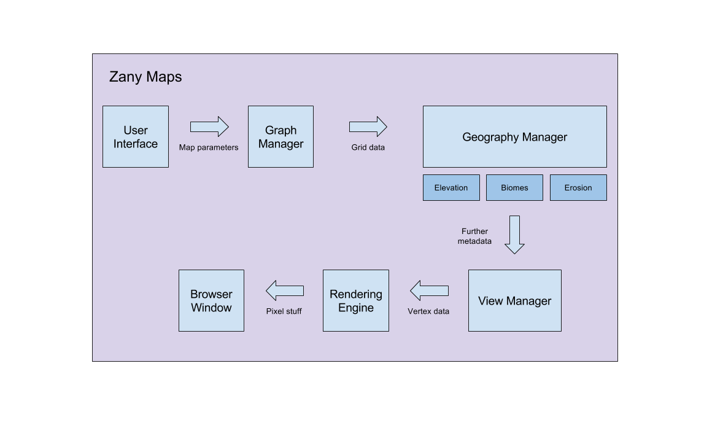

# Zany Maps: Procedurally Generated Maps

Zack Elliott

## Updated Design Doc:

### Introduction:

I read a lot of fantasy books when I was younger (Redwall, The 13½ Lives of Captain Bluebear, The Bartimaeus Trilogy, etc…) and always enjoyed flipping to the cover to look at the maps the author and illustrator had created.  In an attempt to reignite my childhood passion for awesome fantasy maps, I thought it would be neat to build a web service that procedurally generates these maps.

### Goal:

Zany Maps is a service that procedurally generates realistic and interesting maps.  Every aspect of these maps – including the geography, topography, and coloring – will be generated using procedural concepts I have learned in CIS 700.

### Inspiration / Reference:

Polygon Map Generation:
 - Main demo: http://www-cs-students.stanford.edu/~amitp/game-programming/polygon-map-generation/demo.html
 - Accompanying article: http://www-cs-students.stanford.edu/~amitp/game-programming/polygon-map-generation/

Generating Fantasy Maps:
 - Main demos and article: https://mewo2.com/notes/terrain/

### Specification:

Core features:
 - Users can efficiently create and customize procedurally generated maps
 - Users can select methods of generating the underlying graph
   - Points grid structure (e.g. Voronoi diagram, square grid, hexagon grid, etc…)
   - Other minor parameters (e.g. number of points, random noise seed, etc...)
 - Users can add additional geographical features to the map, each of which can be customized by a number of parameters
   - Elevation map
   - Moisture map
   - Biomes (e.g. elevation and moisture combinations map to different biomes)
   - Rain distribution
   - Erosion naturally transforms the map
 - Users can select to view the map from a number of different perspectives
   - Simplified 2D view allows the user to view the underlying elevation/moisture maps, graph structure, and certain types of nodes
   - Tessellation process transforms the 2D map along with its elevation to a 3D representation
   - Shaders are used to efficiently render the map and smooth between different biomes
 - Users can customize many, many parameters in the map-generation process via a DAT.GUI display

### Techniques:

Below are a list of techniques and concepts I have learned in CIS 700.  Below each concept are specific ways that use it in my project.
 - Noise functions (e.g. simplex)
   - Generate and fine tune elevation and moisture maps
 - Voronoi diagrams
   - Generate underlying grid structure
   - Traverse with traditional graph algorithms
 - Graph data structures and algorithms
   - Store the underlying cell grid in an efficient manner (e.g. using a modified half-edge structure)
   - Use traversal algorithms such as BFS/DFS to walk the graph structure
 - Gradient maps
   - Apply elevation and moisture maps to the grid that map to different biome patterns
   - Enable different gradient maps depending on the map view (e.g. elevation, moisture, etc…)
 - Shaders
   - Color the map efficiently by assigning elevation and moisture on a per-node basis, and allowing shaders to blend biomes on a per-pixel basis
 - 3D rendering
   - Implement a polygonized 3D view of the generated map

### Design:

### Timeline:

 - Week of 4/3
   - Setup basic project framework (using HW base code) and user interface (DAT.GUI)
   - Implement the Grid Manager (responsible for generating the base grid)
 - Week of 4/10
   - Implement the Continent Manager (responsible for defining the base coastlines and shape of the continent)
   - Implement basic rendering
 - Week of 4/17
   - Implement components of the Geography Manager (elevation, biomes, rivers, lakes, etc…) and the View Manager in conjunction.  This will be necessary as in order to debug aspects of the Geography Manager, I will need to be able to properly render them.
 - Week of 4/24
   - Continue with the week of 4/17 task
 - Week of 5/1
   - Fine tune and polish project
   - If time, implement Erosion Manager (erodes basic continent & coastline)

## Results:

Demo link: http://zelliottm.com/Final-Project/

3D rendering of a map with an underlying hex-cell grid, distributed biomes, and light erosion.

The same map as above, this time in 2D, viewed from above.  Additionally, instead of assigining biomes on a per-cell basis, I assign elevation and moisture to each node in the grid, and then a fragment shader assigns biomes on a per-pixel basis.

This view of the map is useful for debugging.  You can see the underlying grid structure (a square-cell grid is used) and the coastal nodes (points are in black).

This is the same view as above, but now an underlying Voronoi grid structure is used.

This view of the map shows how a 2D Simplex noise distribution is used to apply an elevation map to the grid.

There are a ton of ways to modify parameters in the map-generation process, categorized by their specific parent manager classes.

## Evaluation:

Overall, I was most pleased with how my program structure remained clean and organized as I added additional features and reworked existing code.  All of my code is divided into three distinct classes (GraphManager, GeographyManager, and ViewManager), which allows me to (1) easily debug hairy problems and (2) enable many, many aspects of the map generation to be customized by users.  Additionally, I was happy I was able to store square-cell grids, hex-cell grids, and voronoi diagrams in a universal graph data structure... essentially a modified half-edge structure.  Consequently, the other managers are agnostic as to the exact type of grid they are communicating with, which is very neat as it allows the underlying grid to be changed in real-time.  Finally, I also implemented *almost* everything specified in my writeup (except lakes and rivers creation, as I couldn't figure out a nice natural way to generate them).

Instead of hard-coding in any finely-tuned parameters, I allow essentially all parameters to be customized by the user.  This is really useful for debugging, and gives the user more control over the map-generation process.

Given I completed this product in stages, many of the WIP images can be reconstructed by simply viewing maps in different ways.  For example, by rendering a map in 2D mode, colored by the elevation map, with the grid structure enabled, this represents how far I had gotten in milestone #1.  In other words, I first implemented the basic structure of of each manager, to ensure that my overall project structure was sound.  Then, I began implementing components of each manager (e.g. starting with the square/hex-cell grids in the GraphManager, the elevation/moisture maps in the GeographyManager, and basic rendering methods in the ViewManager).  Thus, upon completion of the final project, I can reconstruct WIP images by essentially turning off features in each manager.

## Future Work:

 - More accurate erosion algorithm: The current erosion algorithm I am using is relatively basic.  First, scatter rain droplets on nodes according to some distribution.  Second, each droplet traverses the map's graph structure by finding the lowest adjacent neighbor and recursing.  Third, on each recursion step, each droplet keeps track of its current speed and sediment capacity, and erodes or deposits sediment (i.e. increases/decreases elevation of nodes) based upon these properties and the slope of its current node.  A more advanced erosion scheme would be more physically accurate, as well as take into consideration the moisture and biome at each node.
 - Smooth between biome transitions: When biomes are assigned on a per-node basis and passed into the shader, the biome transitions are not smooth (i.e. are not dithered properly).  I experimented a bit in my shader to try to fix this, but I believe I have to generate the elevation and moisture maps in the shader in order to do this.
 - Rivers and lakes: One of the reasons I did not implement river/lake generation was because I couldn't come up with a realistic (yet easy) generation process that didn't use an already working rain/erosion scheme.  That is, in a spirit to be physically-accurate, I would want to define a rainfall distribution on the map (akin to that used for erosion) that creates rivers and lakes over time.

## Acknowledgements:

Relevant NPM modules used:

 - chroma-js: manages colors
 - noisejs: generates simplex noise
 - seedrandom: generates seeded random numbers
 - voronoi: generates voronoi diagrams

Online resources used:

 - http://www-cs-students.stanford.edu/~amitp/game-programming/polygon-map-generation/
 - http://ranmantaru.com/blog/2011/10/08/water-erosion-on-heightmap-terrain/
 - http://mewo2.com/notes/terrain/