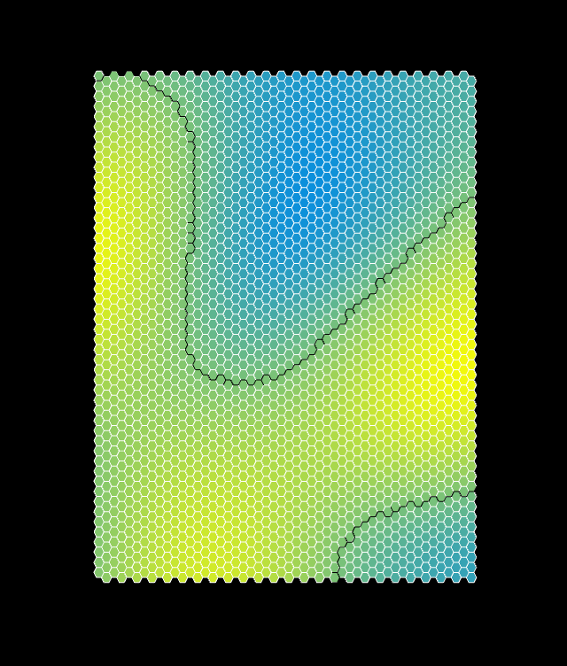

# Milestone 1

### Work completed

I implemented a number of components in the Zany Maps pipeline for this milestone.  First, I designed the general pipeline flow.  I begin by instantiating a Map object, which acts as the overall encapsulating object for my project.  Then, I instantiate various pipeline components: GraphManager, GeographyManager, and ViewManager.  Each of these manager components are instantiated with (1) a reference to the parent Map object (so that they have access to one another's data) and (2) a number of options parameters users can tweak via DAT.gui.  Finally, I call various methods on each of these managers in sequence in order to construct and render the map one step at a time.

The GraphManager holds all grid and graph instantiation and access.  I implemented the methods `generateFromSquareGrid()` and `generateFromHexGrid()`, which allows you to generate different types of grids.  In addition, GraphManager stores the grids as graphs via lists of nodes, edges, and cells, allowing for easy traversal of the grid.  There is a list of Cells, each of which has a center, a list of half edges, and corners.  Corners are equivalent to Nodes, each of which has an id, position, and a list of neighbors.  Half edges are currently unused, although they will be useful in traversing the map during more advanced rendering (e.g. triangulation) and coastline manipulation (e.g. erosion).  Finally, there is also a list of Edges, each of which has start and end nodes.  This storing method is fairly quick to set up, and allows for easy access and traversal of the graph.

The GeographyManager currently manages only generating elevation maps, via the aptly named method `generateElevationMap()`.  This method essentially applies Perlin noise on the scale from -1 to 1 to each corner of each cell (i.e. each node in the graph).  This noise is set as that node's elevation.  Furthermore, each cell's elevation is the average of the elevations of its corners.

The ViewManager handles all map rendering.  The rendering is split up into disjoint methods in order to allow for various portions of the map to rendered or not rendered separately.
 - `renderGraph()` simply renders the the grid itself.
 - `renderElevation()` renders a gradient map for each cell that maps to each cell's elevation.
 - `renderCoastline()` renders a thicker black line that denotes the coastline of the map based upon elevation.  Any cell/node under sea level (i.e. an elevation of 0), is treated as ocean (and vice versa for land)

Below are various screenshots the project's current state:

Grid, elevation, and coastline rendered for a hexagon-cell grid

Grid, elevation, and coastline rendered for a square-cell grid

### To demo:

 1. Simply run `npm install` and `npm run start`
 2. Open up `http://localhost:7000`
 3. Go to `src/main.js` and experiment with the map paramters in the `options` object declared on line 12.